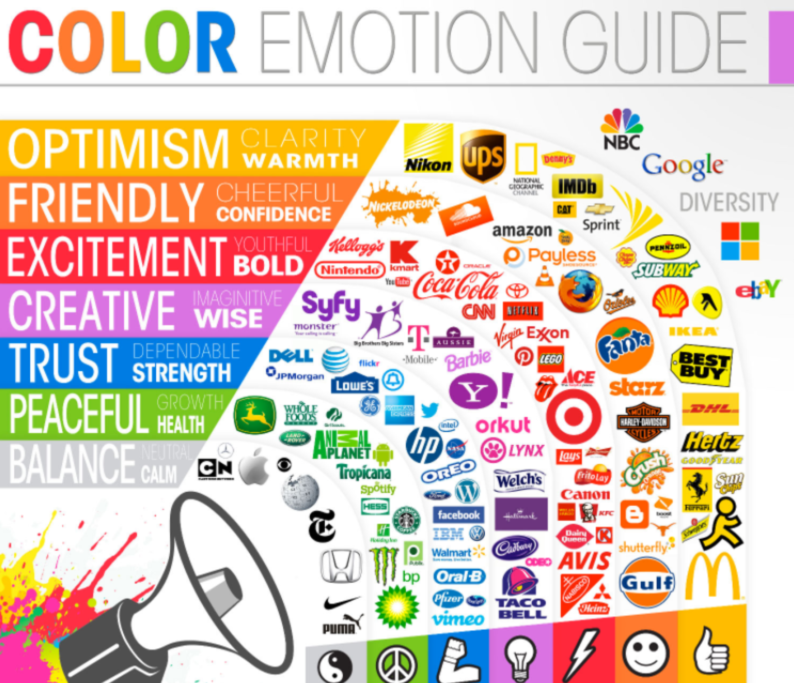

# Accessible Colors

<a href="../">Back to Curriculum Index</a>

## Goals

- Understand the ways that color combinations and schemes can impact your users
- Use tools to test for the various experiences users may have with your app
- Develop and implement an accessible color palette for your site

## Why Does Color Matter?

For users who can see color, it many times is associated with meaning. We associate red with an error, green with a success message, and various colors with specific emotions. We'll talk more about color theory later!

While color can have a positive impact on a users experience, not all users will necessarily get that impact. Colorblind users may actually have a negative impact if the color scheme is used in a way that causes confusion. For these reasons, **we cannot rely on color to convey meaning**.

## Color Blindness

About 4% of the world has some form of color blindness. This means they have the inability to clearly distinguish between various color, and may see colors in a limited range of hues. This can cause difficulties in their daily life. As we build web applications, one thing we need to be cognizant of is making sure that those users still get the full experience on our app and don't run into any confusion due to our use of color, or reliance on color.

There are several types of color blindness. We can use tools like the [Colorblinding Chrome Extension](https://chrome.google.com/webstore/detail/colorblinding/dgbgleaofjainknadoffbjkclicbbgaa/related?hl=en) to view any site, including our own while developing it, to gain perspective on a user with any type of color blindness.

Using the chrome extension, let's take a moment to explore some examples and non-examples from [We Are Colorblind](https://wearecolorblind.com/examples/).

  <h3>Try It: Colorblind Check</h3>
  
Install the <a href="https://chrome.google.com/webstore/detail/colorblinding/dgbgleaofjainknadoffbjkclicbbgaa/related?hl=en">Colorblinding Chrome Extension</a> and test out your 2 favorite/most used sites.

  
<strong>Be ready to discuss:</strong> If you are not colorblind, did you miss out on any features of the site, or get confused about anything as a temporary colorblind user?

## Contrast & Color Accessibility

Contrast is a measure of the difference in brightness between two colors. White text on a white background has a 1:1 ratio. Black text on a white background has a 21:1 ratio. The _minimum_ acceptable contrast is 4.5:1. This ratio should be upheld for:
- Small text
- Images of text
- Outlines on text inputs
- Checkboxes
- Icons

Large scale text and logotypes are exempt; large scale text need a contrast ratio of at least 3:1. [More info here!](https://webaim.org/articles/contrast/)

  <h3>Try It: Check Color Ratios</h3>
  
Visit the <a target="blank" href="https://webaim.org/resources/contrastchecker/">WebAIM Contrast Checker</a>.

  
Check the contrast ratio for any content on your app. If your ratio doesn't meet the criteria yet - that's ok. We'll have work time in the next section to change our palettes.

## Color Palettes

Whether we are conscious of it or not, colors can influence our emotions! Marketing and design teams use the psychology of colors to draw people in to their products.

If you're interested in learning more about color theory, a great place to start is by watching [this conference talk](http://confreaks.tv/videos/keeprubyweird2018-the-teenage-mutant-ninja-turtles-guide-to-color-theory). It's important to note that color association looks different depending on the culture and part of the world.

In addition to the emotion(s) you want to invoke for your user while visiting the site, we should keep contrast in mind. While we need to have a high enough contrast ratio to be inclusive, we want to provide a pleasant experience for users who see full color. This is where the color wheel comes in.

- Complementary Colors
- Triadic Colors
- Analogous Color

[Here's a breakdown of the basic color chords](https://www.tigercolor.com/color-lab/color-theory/color-harmonies.htm).

  <h3>Try It: Choose a Palette With a11y in Mind</h3>
  
Use one of the three resources below to select a color palette for your site. Make sure to include the colors you plan to use for text in the palette!

  <ul>
    <li><a href="https://colors.muz.li/">Muzli Colors</a></li>
    <li><a href="https://htmlcolorcodes.com/color-picker/">HTML Color Codes</a></li>
    <li><a href="https://coolors.co/2364aa-3da5d9-73bfb8-fec601-ea7317">Coolers</a></li>
  </ul>
  
Use the <a target="blank" href="https://webaim.org/resources/contrastchecker/">WebAIM Contrast Checker</a> to ensure that there is adequate ratio between the background and text colors you selected.

  
We'd love to get inspired! Share your palette by taking a screenshot then pasting it in <a href="https://docs.google.com/document/d/1V0PiDnYJdfS7WJb2SLGXRXNU43yfBsYvK12p2wxetrg/edit">this document</a>.

  <h3>Try It: Update Site with Color Palette</h3>
  
Now that you've done the research and curated the perfect palette for your site, it's time to bring it to life! Spend this chunk of work time taking the hex or RGB codes provided in your palette and updating your CSS file. Check in on how things look in the browser.

  
Run the Lighthouse Audit to make sure you don't have any violations in regard to color. If you do, address them, then run the check again!

 
<a href="../">Back to Curriculum Index</a>
