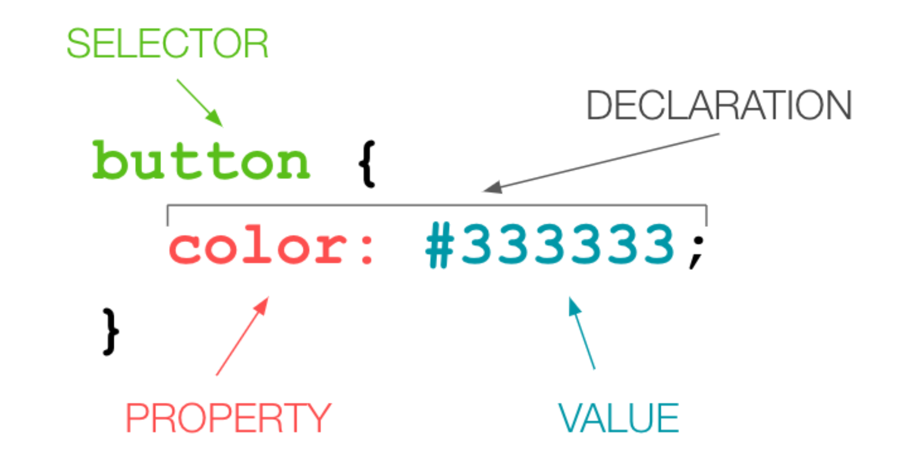

# Intro to CSS

<a href="../../frontend-online">Back to Curriculum Index</a>

## Goals

- Style HTML element using CSS rules
- Use class and ID attributes on HTML elements to more specifically target them in CSS

## What is CSS?

CSS is a way to add style to HTML documents on the web. It's incredibly powerful!

Let's take a look at some examples of CSS in action: [CSS Zen Garden](http://www.csszengarden.com/). You'll notice that every single one of these web pages has the exact same HTML - all the differences in layout and look are achieved through CSS!

While CSS is typically used to control the layout and details of the way a site looks, artists have also used it to create some pretty incredible pieces - check out [these portraits](https://twistedsifter.com/2019/11/painting-with-css-and-html-by-diana-smith/) and [this card](https://codepen.io/ivorjetski/full/ExaKmjw).

## CSS Rules

How do we write CSS code that instructs the browser to make elements appear differently? We write CSS **rules** - a set of instructions for each element to follow.



```css
button {
  color: #333333;
}
```

In the previous example, the browser will set the color of any button on the page to `#333333`. We can provide multiple declarations inside of a rule, such as:

```css
button {
  color: #333333;
  border: 2px solid pink;
  font-family: Ariel;
}
```

## CSS Colors

There are many ways that we can express the value of a color to the browser. Today, we will just discuss two of them:
- [Color Names](https://htmlcolorcodes.com/color-names/) - written in English, these names describe the color. We are limited to 140 of them.
- [Hex Values](https://htmlcolorcodes.com/color-picker/) - a six-digit code (letters and/or numbers) preceded by a `#` allows us to have many more combinations of colors. There are many websites that allow a user to pick a color from a color wheel, then provide the associated hex value.

<div class="try-it-new">
  <h3>Try It: Writing your First CSS Rule</h3>
  <p>In the CSS tab of your CodePen, write a rule that targets all of your <code class="try-it-code">button</code> elements.</p>
  <p>Change the <code class="try-it-code">color</code> and <code class="try-it-code">background-color</code>s with CSS. Observe the output in the browser. What is the difference between these two properties?</p>
  <p>Explore: Remove the <code class="try-it-code">-color</code> from <code class="try-it-code">background-color</code>. What happens? What can you infer from this?</p>
</div>

## Other Commonly Used Properties

There are [520 properties](https://css-tricks.com/how-many-css-properties-are-there/) available in the CSS language. It is unlikely that any developer knows every single one. But, there are many commonly used properties that folks who write CSS with some regularity will come to memorize.

Here are a few great places to start:
- [**font-size**](https://developer.mozilla.org/en-US/docs/Web/CSS/font-size): this property expects a value with a unit; today we'll introduce `px` (pixels) and `%` (percent). Example declaration: `font-size: 150%;`
- [**border**](https://developer.mozilla.org/en-US/docs/Web/CSS/border): accepts 3 pieces of information: the width of the line, the style of the line, and the color. Example declaration: `border: 2px solid #401AA5;`
- [**height**](https://developer.mozilla.org/en-US/docs/Web/CSS/height) & [**width**](https://developer.mozilla.org/en-US/docs/Web/CSS/width): each of these properties needs a value with a unit. We recommend starting with pixels. Example declaration: `height: 200px;`

<div class="try-it-new">
  <h3>Try It: Exploring CSS</h3>
  <p>Write a CSS rule that targets the paragraphs, then change their <code class="try-it-code">background-color</code> and <code class="try-it-code">font-size</code>.</p>
  <p>Next, write a rule that targets the main heading - change the <code class="try-it-code">color</code> of the text and add a <code class="try-it-code">border</code>.</p>
  <p>Continue to explore and add declarations to make the site your own!</p>

  <div class="spicy-container">
    <p class="spicy-click">🌶 Finished? Click here for a Spicy Challenge 🌶</p>
    <div class="spicy-toggle">
      <p>Check out the <a href="https://developer.mozilla.org/en-US/docs/Web/CSS/opacity" target="blank">opacity</a> and <a href="https://developer.mozilla.org/en-US/docs/Web/CSS/box-shadow" target="blank">box-shadow</a> properties and implement them on your site.</p>
    </div>
  </div>
</div>

## Classes and IDs

There will be times when we want to target _one_ paragraph element, but not the 37 others on the site. There will also be times when we want to write a CSS rule for some paragraphs, but not all. This is a great opportunity to use a class or ID attribute!
- **Classes** can be used to identify one or more than one elements
- **IDs** can be used to uniquely identify one element

Below is the syntax to apply classes and IDs to HTML elements:
```html
<h2 class="sub-heading">Welcome!</h2>
<button id="log-in-btn">Enter Site</button>

<h2 class="sub-heading">More Info Below</h2>
```

To target them in CSS, we need to use a specific syntax:

```css
/* classes start with . */
.sub-heading {
  color: teal;
}

/* IDs start with # */
#log-in-btn {
  background-color: grey;
  border: 3px solid teal;
}
```

<div class="try-it-new">
  <h3>Try It: Classes & IDs</h3>
  <p>In the <code>style.css</code> file, use a class attribute to give the same styles to 2 of your paragraphs, but not to the other(s).</p>
  <p>Based on how you'd like to style your page, if you see the need for other classes or IDs, go ahead and implement them!</p>
  <p>As you are probably in the habit of by now, observe the changes in the browser.</p>
</div>

<!-- ## Layout

Controlling the layout of a page with CSS is notoriously difficult. There are many ways to create the same layout - so there is no **one right answer** or solution.

Today, we will discuss two methods to begin controlling a layout.

### Display

The display property allows us to manipulate the layout of elements on a page without taking them out of the normal page flow. Elements either default to "inline" or "block".

<p class="codepen" data-height="300" data-theme-id="37918" data-default-tab="html,result" data-user="turing-school" data-slug-hash="NWNOrox" style="height: 300px; box-sizing: border-box; display: flex; align-items: center; justify-content: center; border: 2px solid; margin: 1em 0; padding: 1em;" data-pen-title="Block v Inline">
  <span>See the Pen <a href="https://codepen.io/turing-school/pen/NWNOrox">
  Block v Inline</a> by Turing School (<a href="https://codepen.io/turing-school">@turing-school</a>)
  on <a href="https://codepen.io">CodePen</a>.</span>
</p>
<script async src="https://static.codepen.io/assets/embed/ei.js"></script>

In the previous CodePen, we see the title and paragraphs taking up the entire horizontal space they sit on - they are "block" elements.

We also see the links embedded in the paragraphs that do not create a line break - they are "inline".

Sometimes, we want to change the display of an element. We can do this with a rule such as:

```css
p {
  display: inline; /*since p is defaulted to block, we can change it to inline*/
}

img {
  display: block; /*since img is defaulted to inline, we can change it to block*/
}
```

<div class="try-it-new">
  <h3>Try It: Display</h3>
  <p>In the <code>CSS</code> change the display of at least two elements. Observe the results in the browser - did it do what you think it would? Keep in mind that the elements above/below it in the code may also be influencing how everything appears in the browser.</p>
</div> -->
<!--
### Float

“Floating” an element takes it out of the normal flow, and places it as far to the left or right of its containing element as possible. Any other elements, such as paragraphs or lists, will wrap around the floated element as seen [here](https://codepen.io/LouisaBarrett/pen/GwwKGN).

> In the linked CodePen, try changing "left" to "right" on line 7 - what happens?

**Note:** You will usually need to specify a width (or height, for an image) when floating an element, otherwise the element may take up the whole page and not appear floated.

<div class="try-it-new">
  <h3>Try It: Float</h3>
  <p>In the <code>CSS</code> file, add a declaration to float your buttons. Play around with floating right and left.</p>
  <p>Finished? Use a class or ID to float only one or some buttons.</p>
</div>
 -->


<br>
<a href="../../frontend-online">Back to Curriculum Index</a>
