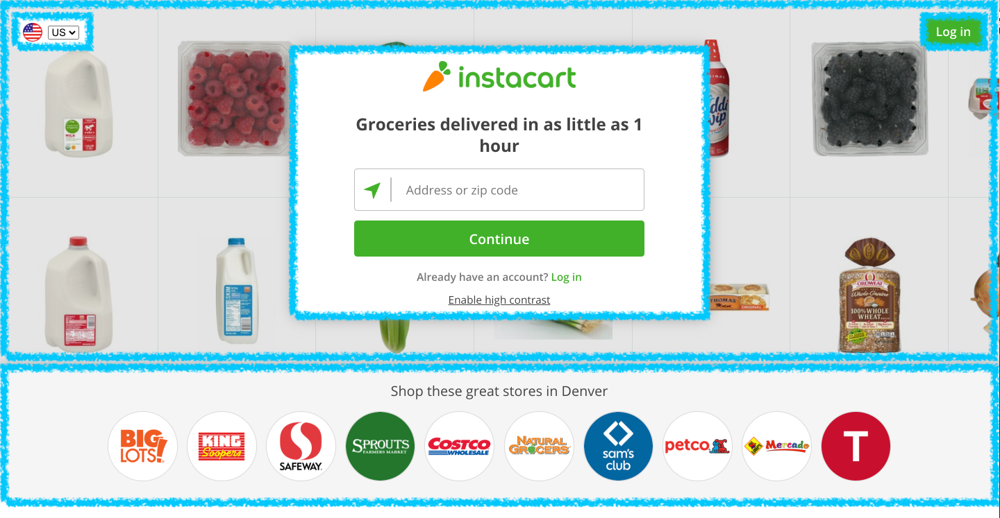

# HTML & CSS Review

<a href="../">Back to Curriculum Index</a>

## Goals

- Warm up and refresh our brains on what we learned yesterday
- Use container elements to group elements


## Review Your Code

A lot of times, the code we write makes sense in the moment, but when we come back to it the next day, or week or month, we need a few minutes to re-read and make sense of what it does!

Before the head into the day of adding to your current project, you are going to spend a few minutes sharing your code with another participant!

<div class="try-it-new">
  <h3>Review & Share</h3>
  <p>In your breakout room, determine who has the longest first name. That person shares first.</p>
  <p>Either screen share or share the link to your repl. Explain what HTML elements you used. Explain how XYZ element showed up the way it did (what CSS code you wrote). Share anything else you are proud of and/or still have questions about.</p>
  <p>Switch and let the other person share!</p>
</div>

## Containers

Sometimes we will want to group elements so that we can control the layout, colors, etc. or, to communicate that those pieces of information belong together. Let's think about the landing page for Instacart, for example:


<br>
<br>

If we thought about how all this content gets displayed in terms of containers, we may mark it up like this:



Today, we will use the `div` element to group or contain other, non-list item, elements. The `div` element has been referred to as "flavorless jello" since it doesn't do anything besides contain other elements, no magic or anything special built-in.

Here's an example of the syntax we might use to start creating something similar to what is pictured above:

```html
<body>  
  <div>
    <button>US</button>
    <button>Log In</button>
    <div>
      <h1>Instacart</h1>
      <!-- form and info here... -->
    </div>
  </div>
  <div>
      <h2>Shop these great stores in Denver</h2>
  </div>
</body>
```

<div class="try-it-new">
  <h3>Try It: Containers</h3>
  <p>Find a place in your existing project where a <code>div</code> may be helpful. Add at least one <code>div</code> so that it nests some existing elements.</p>
  <p>Then, add a border or background color so you can see it.</p>
</div>
