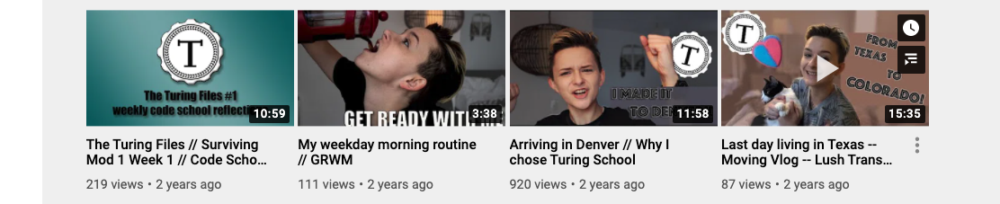
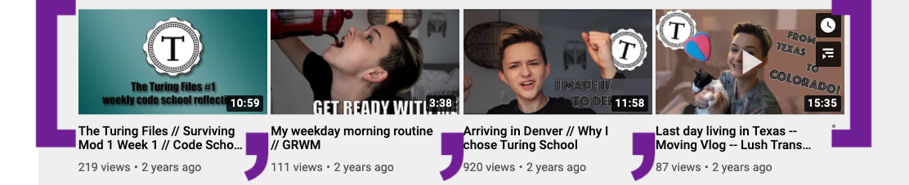

# Arrays

<a href="../">Back to Curriculum Index</a>

## Goals

- Use Ruby syntax to declare variables that store Arrays
- Explain use cases for Arrays
- Access elements by index
- Use array methods to add, remove, and shuffle elements

## Lists

Ruby provides us with a data type that can hold multiple pieces of data in a list. Imagine looking at a list of variables for each class taught in your school:

```ruby
city_1 = "Denver"
city_2 = "LA"
city_3 = "NYC"
city_4 = "Philadelphia"
# etc...
```

This would soon be a LOT of code to initially type, to maintain over time and to create opportunities for typos. This pattern would defeat the point of programming which is to automate work!

If we have a list of similar items that we want to group together Ruby gives us a way to do that which only requires one variable.

## Arrays

An **Array** can hold as many pieces of data as we want it to. We refer to each piece of data as an **element**. The syntax Ruby expects for these lists is as follows:

```ruby
cities = ["Denver", "LA", "NYC", "Philadelphia"]
populations = [1456, 3287, 7610, 5711]
```

A few things to notice:
- Variable names should be plural
- Each element inside of the array is separated by a comma and one space
- All elements in the array are of the same data type (best practice but not required)

## Arrays IRL

It’s very likely that every application you’ve used - on a phone or laptop - utilized arrays in the code that built it.

We can’t see all the code that built every application, but there are some places where it’s very clear that an array would be the best tool to use. Here are some examples from sites we may be familiar with:

- [Instagram](https://www.instagram.com/alfie_the_alpaca_in_adelaide/) uses arrays to hold all the posts for a given user. Alfie the Alpaca has over 800 posts, so the array is over 800 elements long!
- [YouTube](https://www.youtube.com/) uses an Array to hold all videos. It uses another  Array to hold all videos that a signed-in user has "liked". It uses another Array to hold all recommended videos for a given user at a given time.





```ruby
videos = ["Surviving Mod 1 Week 1", "My Weekday Morning Routine", "Arriving in Denver", "Last Day Living In Texas"]
```

<div class="try-it-new">
  <h2>Share Out</h2>
  <p>Where might an array be used in one of the sites <em>you</em> use on a regular basis?</p>
</div>

## Access Elements

We can rely on Arrays to keep our data in order. Each element, based on it's location in the Array, is assigned an index position. In programming, numbering starts at 0, so the first element is in position 0.

```ruby
cities = ["Denver", "LA", "NYC", "Philadelphia"]
```

The syntax to access an element is below. We instruct the program to that we want to look at the `cities` array, then more specifically, the element at `n` position.

```ruby
cities[0]
# --> "Denver"

cities[1]
# --> "LA"

cities[2]
# --> "NYC"

cities[3]
# --> "Philadelphia"
```

<div class="try-it-new">
  <h2>Try It: Declaring Arrays & Accessing Values</h2>
  <p>In repl, declare a variable that stores an array of at least 5 elements, each being the name of <strong>a site or app that you frequent</strong>.</p>
  <p>Print out the entire array, then individually print out all 5 site/app names to the console.</p>
  <div class="help-container">
    <button class="help-click">🤚Help Me!</button>
    <div class="help-toggle">
      <pre>frequent_sites = ["Twitter", "GitHub", "Reddit", "Gmail", "my bank"]

puts frequent_sites[0]
puts frequent_sites[1]
puts frequent_sites[2]
puts frequent_sites[3]
puts frequent_sites[4]</pre>
    </div>
  </div>

</div>

## Array Methods

Similar to the `.length`, `.upcase` and other methods we briefly saw in action for Strings, there is a whole set of Array methods available to us. We'll just dive into a few in our work today, but as always, let your curiosity guide you if you want to explore more!

### .count

The count method allows us to check the number of elements in the array it is called on

```ruby
cities = ["Denver", "LA", "NYC", "Philadelphia"]
puts cities.count
# --> 4
```

### .pop

The pop method allows us to remove the last element from the array it it called on

```ruby
cities = ["Denver", "LA", "NYC", "Philadelphia"]
cities.pop

puts cities
# --> [["Denver", "LA", "NYC"]
```

### .push

The push method allows us to add an element to the end of the array it is called on. In order to tell Ruby what element to add, we must include inside of `( )` after `.push`

```ruby
cities = ["Denver", "LA", "NYC", "Philadelphia"]
cities.push("Austin")

puts cities
# --> ["Math", "ELA", "Theater", "Science", "Austin"]
```

### Quick Recap:

- `.count` counts the total number of elements in the array
- `.push` adds an element to the end of the array
- `.pop` removes the last element from the array

<div class="try-it-new">
  <h2>Try It: Array Methods</h2>
  <p>Earlier, you delcared a variable that stores an array of site/app names. Below that code, write code to <strong>remove all the sites in that array</strong>, one by one.</p>
  <p>Print out the array. Then, programmatically check (and print out) the length of the array.</p>
  <p>Now, <strong>add in 5 new sites</strong> to the array! Print the array again out to make sure they are in there.</p>

 <div class="help-container">
    <button class="help-click">🤚Help Me!</button>
    <div class="help-toggle">
      <pre>frequent_sites = ["Twitter", "GitHub", "Reddit", "Gmail", "my bank"]

frequent_sites.pop # repeat this line 4 more times
puts frequent_sites
puts frequent_sites.length
students.frequent_sites("Google Drive") # repeat 4 more times, with diff sites</pre>
    </div>
  </div>

  <div class="spicy-container">
    <p class="spicy-click">Click here for an Early Finisher Challenge!</p>
    <div class="spicy-toggle">
      <p>Look into two other Ruby methods: <code class="try-it-code">shift</code> and <code class="try-it-code">unshift</code>. You can run a google search or start with <a href="https://dev.to/ddhogan/quick-reference-for-array-methods-pushpop-vs-shiftunshift-4g7h">this resource!</a></p>
    </div>
  </div>

</div>

## Choosing a Random Element

There are myriad real world connections we can make to web or mobile apps using randomization: quote/photos of the day, shuffling the order of songs on a playlist, Slack notifications when your have nothing to read.

There are a few ways we can go about it programmatically. Let's first consider the path laid out in this _pseudo-code_:

```ruby
# 1. find the length of the array
# 2. generate a number between 0 and the number found in step 1
# 3. access the element at that index position
```

The example above works and is the main path to implementation in other languages, but Ruby is so friendly that it [built in a method that shuffles an array](https://stackoverflow.com/questions/1816378/how-to-randomly-sort-scramble-an-array-in-ruby)! Check out this simpler pseudo-code path:

```ruby
# 1. shuffle the array
# 2. access the element at index 0
```

```ruby
messages = [
  "😎All clear.", 
  "🚜You're all read. Here's a tractor.",
  "🏎 There. All caught up.",
  "✌️ All caught up. What's next?",
  "🙌That's everything!",
  "🐝You're up to date. Go forth and do great things.",
  "🚀All done. The future is yours."
  ]
```

<div class="try-it-new">
  <h2>Try It: Empty Inbox Message</h2>
  <p>Write code to shuffle the above array, then print out the message in position 0.</p>
  <p>Run the program several times to verify it's working as expected.</p>
  <p>If you'd like, add to or change any of the messages in the array.</p>
  <div class="help-container">
    <button class="help-click">🤚Help Me!</button>
    <div class="help-toggle">
      <pre>messages = ["😎All clear.", "🚜You're all read. Here's a tractor.", ...]

messages.shuffle 
puts messages[0]</pre>
    </div>
  </div>
  <div class="spicy-container">
    <p class="spicy-click">Click here for an Early Finisher Challenge!</p>
    <div class="spicy-toggle">
      <p>Your current program is probably operating in a way that is putting each emoji/quote back in the list of all emojis/quotes once it's been used. What if, after showing a message, you wanted to take that message out of the list? <em>(Hint: you might need to google how to remove the first element of an array in Ruby if you haven't already!)</em></p>
    </div>
  </div>


</div>

<a href="../">Back to Curriculum Index</a>
