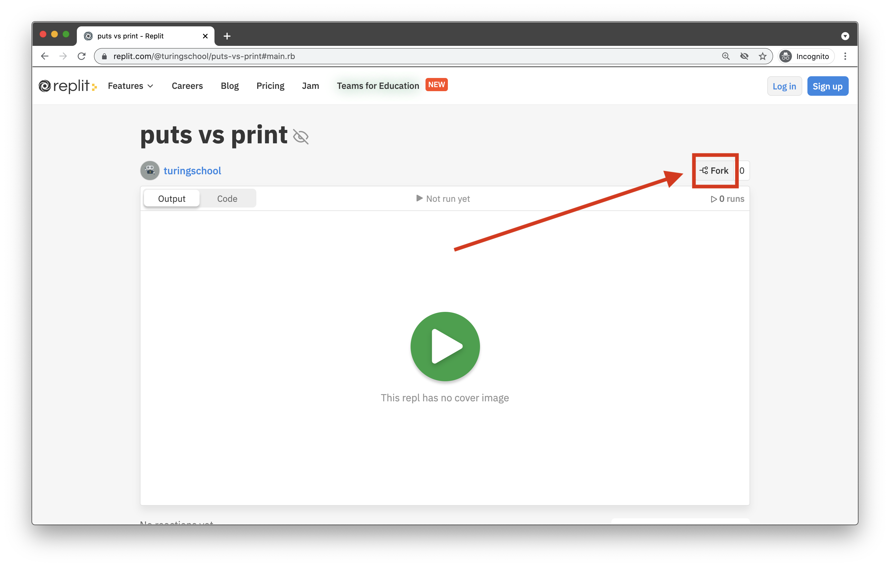

# What is Back-End Engineering?

<a href="../">Back to Curriculum Index</a>
 

## Goals

- Identify the key differences between Front-End and Back-End engineering
- Categorize various technologies used in Back-End engineering
 

## What is Back-End?

In a broad sense, Back-End engineering is concerned with managing and manipulating ​data​ (aka information).

Consider a website like Instacart. When we view an Instacart page, what are the parts we actually care about? Why did we come here in the first place? In the screenshot below, the blue boxes represent examples of **dynamic data** that had to come from somewhere. That "somewhere" is what Back-End engineering is concerned with.

When we talk about Back-End engineering, we're often thinking of the engineering tasks involved in making this possible:

- Storing data and accessing it later
- Verifying that data is accurate
- Manipulating, analyzing, and/or calculating data
- Making sure data can be retrieved quickly and easily
 

## Back-End & Front-End

The **Front-End** is the part of the application that users see, touch, and interact with. This is the code that produces the experience in front of the user. All of the stylistic pieces of a website (layout, colors, sizes), in addition to logic around user interactions, are considered **Front-End** concerns.

The **Back-End** typically handles stuff like storing information in databases, manipulating that data, authenticating users, etc.; it's what happens behind the scenes.
 

## What technologies are used on the Back-End?

There are numerous technologies that can be used for Back-End engineering. Here are a few of them:

- **Languages and frameworks**: Ruby/Rails, Python/Django, Elixir/Phoenix, Java/Spring, and more.
- **Databases**: PostgreSQL, MySQL, Oracle Database, MongoDB, etc.

We won't be talking about anything except for a teeny tiny part of Ruby. However, we hope that these terms give you a lay of the land so that next time you hear one of these words, you can say "Aha! That's a database."

## Forking a Repl.it

Throughout the workshop, you will be provided with links to repl.it projects in the zoom chat. If you want to modify that code, you'll need to **🍴fork** it, which means make a copy of that project to your account. This screenshot below highlights the button you will click to do that:

The screenshot above pictures the project we will start with in the next section. Let's take a moment to practice and make everyone can get this forked. [Your instructor will share the link in the chat or you can access it here](https://replit.com/@turingschool/puts-vs-print#main.rb)!

<a href="../ruby-review">Next: Ruby Review</a>
