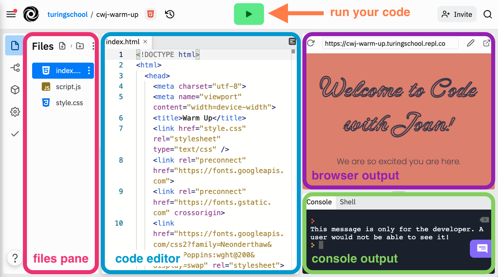
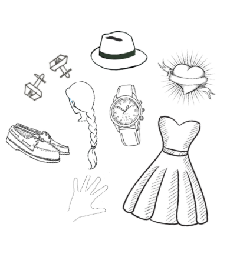
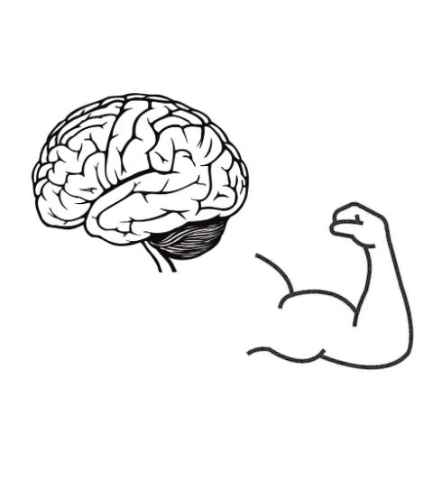

# Code With Joan

In this live, instructor-led workshop, you will build an interactive webpage with interactive buttons that hide and reveal information. 

_This will be best experienced on a desktop or laptop computer._

## Welcome!

We are so glad you are here! To get set up...
1. Open up <a target="blank" href="http://repl.it/">repl.it</a> in a browser (preferably Chrome) and log in to your account
1. Please change your zoom name to first, last initial, pronouns (ex: _Amy H. (she/her)_)
 

## Goals

- Build and customize an <a target="blank" href="https://cwj-checkpoint-3.turingschool.repl.co">interactive website</a>
- Gain _exposure_ and familiarity with some HTML, CSS, and JavaScript
- Determine if coding is something you enjoy doing and want to pursue further
- Meet other women+ working in tech and curious about tech

Disclaimer: We won't become experts in these languages today. And you may leave with more questions than answers!
 

## What to Expect
- Welcome and Setup (1 hour)
- Instruction (2 hours and 30 minutes)
- Lunch Sessions (1 hour)
- Group Challenge (1 hour and 30 minutes)
- Presentations and Wrap-Up (1 hour)

## Online Learning Norms
- Ask your questions and share your code!
- Mute your microphone unless you’re the main speaker.
- Keep your camera on during class.
- Disconnected? Jump back on! The host or TA will resume the session shortly.

Want to get my attention during the workshop? Raise your hand, type your question in the chat, or come off mute and ask!

## Warm-Up Activity

Let's start by taking a tour of the replit interface. Replit is an IDE (integrated development environment) that allows us to write and see the output of our code all in one place. Below, you can see an image outlining the different tools available in the replit interface.

Here's how to start the warm-up activity:
1. Click <a target="blank" href="https://replit.com/@turingschool/cwj-warm-up#index.html">this link</a> to open up the warm-up activity in replit.
1. Click the blue `Fork repl` button in the top right corner to make a copy of the warm-up for yourself.
1. Click the green `Run` button at the top of the page and you should see the browser output appear!

You will complete a <strong>scavenger hunt</strong> to familiarize yourself with the replit interface. Pick your challenge level and let's get started!

  <header>
    <h3 class="spicy-click">Mild 🔥</h3>
    
<button class="expander-btn"></button>

  </header>
  

    <ol>
      <li>What line number in the <code>index.html</code> file is responsible for the "We are so excited you are here" text in the browser window?</li>
      <li>Which file is responsible for the message we see in the console output area?</li>
      <li>What line number in the <code>style.css</code> file made the heading have a fancy font?</li>
    </ol>
  

  <header>
    <h3 class="spicy-click">Medium 🔥🔥</h3>
    
<button class="expander-btn"></button>

  </header>
  

    <ol>
      <li>In the <code>index.html</code> file, change the text for the paragraph and click the green Run button to see the result.</li>
      <li>In the <code>script.js</code> file, write another line of code that prints another message in the console area.</li>
      <li>In the <code>style.css</code> file, change the background color to any other color.</li>
    </ol>
  

  <header>
    <h3 class="spicy-click">Spicy 🔥🔥🔥</h3>
    
<button class="expander-btn"></button>

  </header>
  

    <ol>
      <li>In the <code>index.html</code> file, what does the title tag in line 6 do?</li>
      <li>What is the keyboard shortcut to comment out a line of code in your replit project? Hint: Google might have the answer!</li>
      <li>How would we change the font size of the text that says "We are so excited you are here"?</li>
    </ol>
  

 

## Zoom Tools

To review our answers to the scavenger hunt, we will use our zoom tools. 
- Zoom Chat - Type your answer to each question, but wait to send it until I say go!
- Raise Hand - Find the reactions button and raise your hand if you would like to share.

 

  <h2>Breakouts: Introductions</h2>
  
In alphabetical order by first name, please share:

    <ul>
      <li>Your name</li>
      <li>Your pronouns</li>
      <li>Your location</li>
      <li>Why did you decide to join this workshop today?</li>
    </ul>

## Be Nice to Yourself

This might be your very first day working with code. Learning is often uncomfortable and things are bound to break. Let's practice working through some common errors together.

  <header>
    <h3 class="spicy-click">My code is broken! What do I do?!</h3>
    
<button class="expander-btn"></button>

  </header>
  

    
Fork <a target="blank" href="https://replit.com/@turingschool/find-the-error#index.html">this replit</a> and see if you can spot the <strong>one mistake</strong> in each file.

    <ol>
      <li>Don't panic. There are some things that will break often. Check those first.</li>
        <ul>
          <li>Did you spell everything correctly?</li>
          <li>Do you have closing symbols for every block or element?</li>
          <li>Do the colors follow a predictable pattern?</li>
        </ul>
      <li>To avoid breaking lots of things all at once, use the green <code>Run</code> button after every change you make!</li>
      <li>Ask for help!</li>
    </ol>
  

 

## Programming Languages We Will Use

Building the user-facing part of a website or app is referred to as Front End Engineering. Writing code to build a Front End requires using three programming languages, and making the code in each language "talk to" the code in the others.

It can feel like a lot, but let's start by understanding the role of each language in the context of our application. We will make some comparisons to the human body as a frame of reference.

<section class="data-type-cards language-cards">
  

    <h3>HTML</h3>
    
HTML holds the content we see on a page (text, images) and defines the structure and order in which the content appears.

    
We can think of HTML as the skeleton of our webpage; without it, we'd just be a blob:

    
  

  

    <h3>CSS</h3>
    
CSS defines the look and feel of a webpage - it can change the size or layout of items on a page, change colors, fonts, and more!

    
We can think of CSS as anything that makes us unique and recognizable - our skin, hair, clothes, style, etc.

    
  

  

    <h3>JavaScript</h3>
    
JavaScript is what lets the user interact with a page. For example, clicking a button and getting some sort of response.

    
We can think of JavaScript as the brain and muscle of our webpage, as it powers all the action:

    
  

</section>
 

## Project Setup

We will work off of a starter kit that has already been created. <a target="blank" href="https://replit.com/@turingschool/cwj-starter-kit#index.html">Click this link to access the starter kit</a> in replit. Here's how to get set up:
1. Once you are on the site, substitute your name in for the `NAME` placeholder on line 14 of the HTML file.
1. Click the green "Run" button at the top of the page, and you should see a simple version of your website on the right side of the page.

In the next part of the lesson, we will explore the HTML file to understand the “bones” of this app.

 

## Now, it gets even more fun:
- [HTML - Content](./html)
- [CSS - Styles](./css)
- [JavaScript - Overview](./js-1)
- [JavaScript - Event Listeners](./js-2)
- [JavaScript - Interactive Buttons](./js-3)
- [Extension Challenge](./extensions)
- [Wrap Up](./wrap-up)