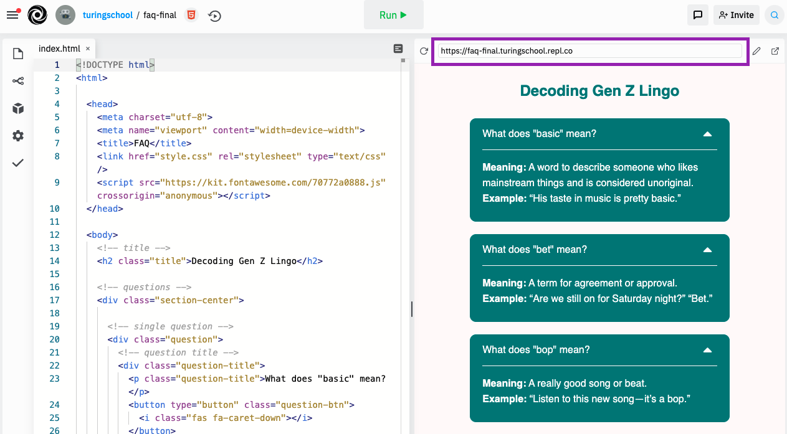

<a href="../">Back to Setup Page</a>

# Code with Joan: Wrap-Up

You did it! 🎉 Thank you so much for spending your Friday with us. I hope that thinking about your reason for why you came, you feel like this time was well-spent and you gained some new knowledge, whether that's about code, Turing, or even yourself!

<strong>Please share about your experience, and how we can best support you moving forward, by completing <a target="blank" href="https://forms.gle/UuK9XBgMKFWxKGu77">this survey</a>.</strong>

## Share It!
One final step... let's make sure everyone can find the link to share your interactive page with the world.

You can find the live URL above the "mini-browser". Copy and paste the link, or click the button in the far-right to open it in a new tab. Have fun! 🎉

<strong>Bonus points if you share on social media and tag Turing!</strong>
- <a target="blank" href="https://www.instagram.com/turing_school/">Instagram</a>
- <a target="blank" href="https://www.facebook.com/turingschool/">Facebook</a>
- <a target="blank" href="https://twitter.com/turingschool">Twitter</a>

## Next Steps
Are you in love with coding? Here are some next steps you may want to take:
- Join us for an information session to learn more about Turing. Email **chelsea@turing.edu** if you want to join.
- Share your contact information on the networking page and connect with people outside of this space!

Want to do a little more exploration before taking the next step toward a career change? Here are some great places to start:
- Attend another <a target="blank" href="https://turing.edu/try-coding">Try Coding</a> workshop. We have a Valentine's Day event coming up next Monday and a Back End workshop February 22.
- Get more exposure and gain comfort with the syntax by working through one of [Codecademy's free tutorials](https://www.codecademy.com/).

<a href="../">Back to Intro page</a>
