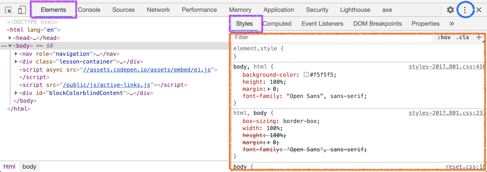
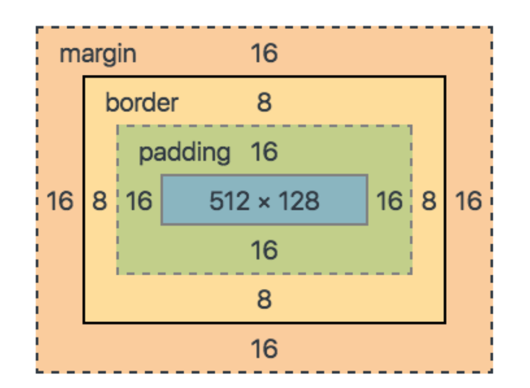

# Dev Tools & CSS

<a href="../">Back to Curriculum Index</a>

## Goals

- Explore the Chrome Dev Tools and utilize them as a resource to learn about the box model
- Fine tune our styles by utilizing margin and padding
- Explain the difference between block and inline

## Chrome Dev Tools

The Chrome Dev Tools are a set of tools for developers to edits pages on the fly and diagnose problems, all within the Chrome browser. Other browsers have their own set of tools, but for consistency, we will all use Chrome today.

The dev tools are very robust; today we will explore a small piece of what they allow us to do.

To open the dev tools:
- While in the browser, right-click and select "inspect" from the drop-down menu that appears. Keyboard shortcuts: Mac: `opt + cmd + i`, PC: `ctrl + shft + j`
- From the horizontal menu at the top, select "Elements"
- We will primarily be looking at the "Styles" pane
- To change the location of the dev tools, click the three small dots at the top-right corner and select a different location



### Change Styles in Dev Tools

Going back and forth from your text editor to the browser to check on every little change you make in CSS can be time-consuming. The dev tools lets us edit CSS rules and see the results - all on the same screen.

To change the styles of an element:
1. Click the small arrow, selector, icon on the far left of the dev tools menu bar
2. Move your mouse to hover over the element you want to select. Once you have found it, click
3. Click you mouse into the CSS rule you'd like to update, in the styles pane
4. Look for changes in the browser

<div class="try-it-new">
  <h2>Try It: Change Styles</h2>
  <p>Go to one of your favorite or most used sites and open the dev tools.</p>
  <p>Select an element of your choice. Edit a rule in the styles pane.</p>
  <p>Check the element in the browser - is it displaying the changes?</p>
  <p>Early Finisher: https://www.lucidchart.com/techblog/2018/05/01/live-editing-html-css-chrome-devtools/</p>
</div>

## Box Model

Now that we've got a handle on the syntax for CSS rules and can navigate the dev tools, we're ready to talk about the box model. Have you noticed that your content is all kind of squished together? The box model can help with that.

Each HTML element is seen as a box by the browser that renders it. Each element can have content, padding, border, and margin. While hovering over elements with the dev tools inspector on, you may have noticed green, blue, and orange highlights appear. Each part of the box model corresponds with a color.



To make sense of the components of the box model, let's compare it to a real-world scenario - a house!
- The house itself is the _content_
- The yard is the _padding_. It's inside the bounds of the property, but outside of the house.
- The gate or fence is the _border_. It marks the edge of the property
- The space between one house and yard and another other house and its yard - the street, sidewalk, alley, etc. is the _margin_. This is the space between homes that is not directly owned by any homeowner.

### Box Model in Action

Let's inspect the box model on a few of your favorite sites.

## Margin & Padding

Now that we've developed an understanding of the box model, let's put it in action by implementing the margin and padding properties.

While margin and padding have slightly different jobs (margin is outside the border, padding is inside), they accept information in the CSS rules the same way.

When we provide a single value to the margin or padding property, all four sides of that element will be impacted.

```css
button {
  padding: 4px;
  /* All four sides of the element will have 4px of padding */
}
```

If we want to be more specific and potentially give different amounts of margin or padding to each side, we can provide these properties with 4 separate values. The first corresponds with top, then it moves clockwise.

```css
button {
  padding: 2px 10px 8px 20px;
  /* top: 2px, right: 10px, bottom: 8px, left: 20px */
}
```

We can combine this knowledge with our skills of using the dev tools to dig more into this. Let's tinker with the margin and padding of some elements on the same site.

<div class="try-it-new">
  <h3>Try It: Margin & Padding</h3>
  <p>Back in your Glitch project, add some margin and/or padding to some elements. Watch what happens in the browser. Tinker with the values you provide to each property to learn more about then and achieve the look you desire!</p>
  <p>Finished Early? Check out <a href="https://alligator.io/css/css-units-explained/">this post</a> to learn about units other than <code>px</code>.</p>
</div>

## Display

- inline, block, none
- Show how dev tools can help us ID how much space an element is taking up
- show how non can be used to hide ads or annoying popups

TRY IT: change some things from inline to block in your project

<br>
<a href="../">Back to Curriculum Index</a>
