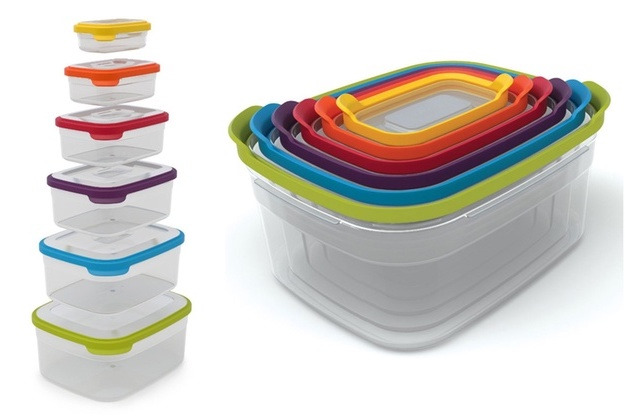
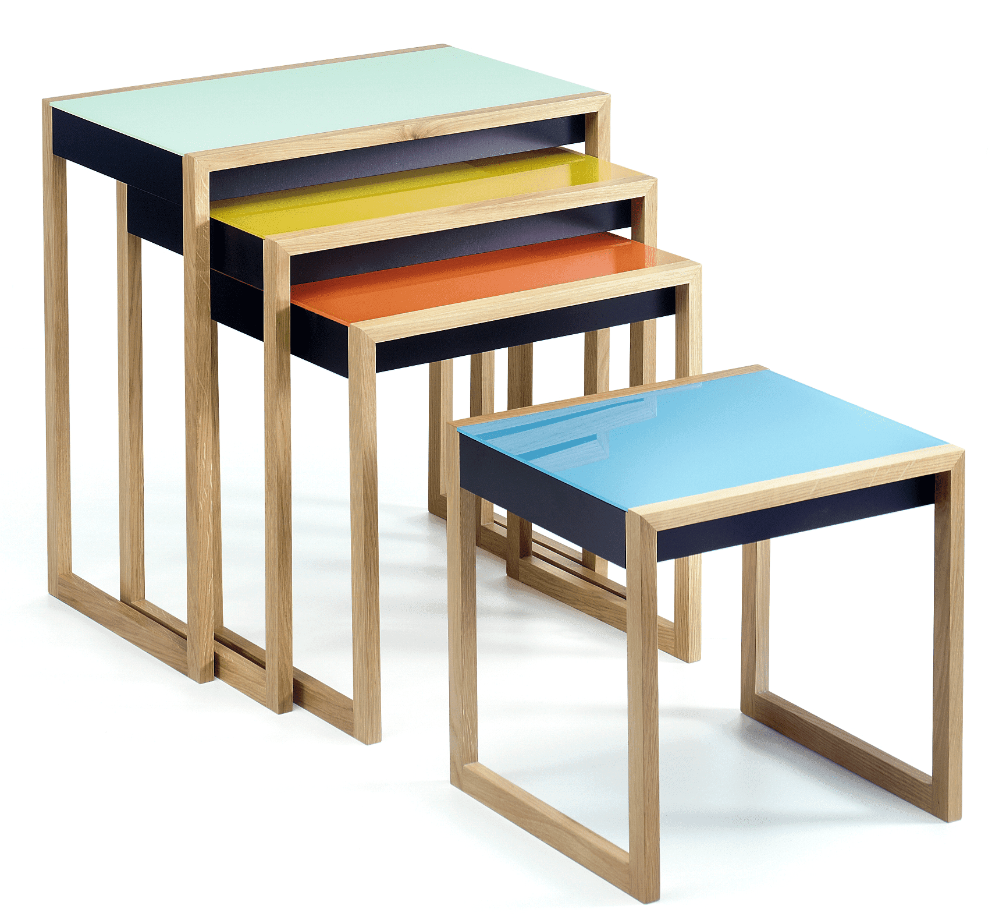

# Containers and Nesting

<a href="../">Back to Curriculum Index</a>

## Goals

- Use container elements to group elements
- Write ordered and unordered lists
- Explore the idea of Developer Empathy

## Nesting

The concept of nesting - the ability of an object to be placed or stored inside of another - is something we see in the design of real-world objects, such as storage containers and furniture:




We also use and see the concept of nesting in code. Instead of food storage containers or tables, we will work with HTML elements that contain other HTML elements.

### Lists

Lists are common on webpages. From bulleted items, to navigation menus with horizontal lists, to a list of followers - they are everywhere! Today, we will focus on numbered and bulleted lists.

We will use an `<ul>` element to wrap as many `<li>` elements as we have list items. Look at the code below for syntax:

```html
<ul>
  <li>Do laundry</li>
  <li>Walk the dogs</li>
  <li>Check the snail mail</li>
</ul>
```

<div class="try-it-new">
  <h3>Try It: Lists</h3>
  <p>Before you think about the code, it's recommended that you jot down your plan. What type of list could you add to your page? What text will each item display?</p>
  <p>Open the <code>index.html</code> file of your Glitch project. Somewhere inside of the <code>body</code> tags, make a list on your page.</p>
  <p>Try using both <code>ul</code> and <code>ol</code> - what is the difference?</p>
  <p>Check in on the "View" of your app to make sure things are showing up as expected.</p>
  <p> Early Finisher? give them a link for how to remove or style bullet points in CSS.</p>
</div>

## Containers

Sometimes we will want to group elements so that we can control the layout, colors, etc. or, to communicate that those pieces of information belong together. Let's think about the landing page for Instacart, for example:


<br>
<br>

If we thought about how all this content gets displayed in terms of containers, we may mark it up like this:


Today, we will use the `div` element to group or contain other, non-list item, elements. The `div` element has been referred to as "flavorless jello" since it doesn't do anything besides contain other elements, no magic or anything special built-in.

Here's an example of the syntax we might use to start creating something similar to what is pictured above:

```html
<body>  
  <div>
    <button>US</button>
    <button>Log In</button>
    <div>
      <h1>Instacart</h1>
      <!-- form and info here... -->
    </div>
  </div>
  <div>
      <h2>Shop these great stores in Denver</h2>
  </div>
</body>
```

<div class="try-it-new">
  <h3>Try It: Containers</h3>
  <p>Find a place in your existing project where a div may be helpful. Add at least one div so that it nests some existing elements.</p>
  <p>Then, add a border or background color so you can see it.</p>
  <p>Check in on the "View" of your app to make sure things are showing up as expected.</p>
</div>

## Code Readability

While reviewing code that others in the class share out, you may have noticed that yours looks a bit different - some people may have blank lines here and there, some may tab in certain elements and others don't.

While HTML allows ignores blank lines and tabs for indentation, following a standard convention is important for the humans who write and maintain the code. This falls under the idea of **Developer Empathy**. There are many facets of developer empathy. Check out the [Dev Empathy Book Club](https://devempathybook.club/about/) to learn more!

Different languages will have their own conventions, and developers will have their own preferences. Very rarely is there one right way and one wrong way; but many possible ways. One rule of thumb, regardless of your language, is to be consistent.

Here are a few conventions specific to HTML:
- Always include an `alt` attribute on images
- Use `kebab-case` for class and ID names
- Do not pad equals signs with spaces when assigning a value to attributes. Example `alt="here is my alt text!"`
- Do not add blank lines without a reason. When blank lines are used, use only one
- Indent any element that is nested inside another
- File names should be lower cased

<div class="try-it-new">
  <h3>Try It: Cleaning Up Code</h3>
  <p>Open and remix <a href="">this Glitch project</a>. First, check out the "View" of the app. Then, read through the HTML document - it may be harder to sift through than it should be! Clean up anything you notice to get this file in shape according to the conventions listed above.</p>
  <p>Check in on the "View" of your app to make sure things are showing up the same as they were before your clean up.</p>
</div>

<br>
<a href="../">Back to Curriculum Index</a>
