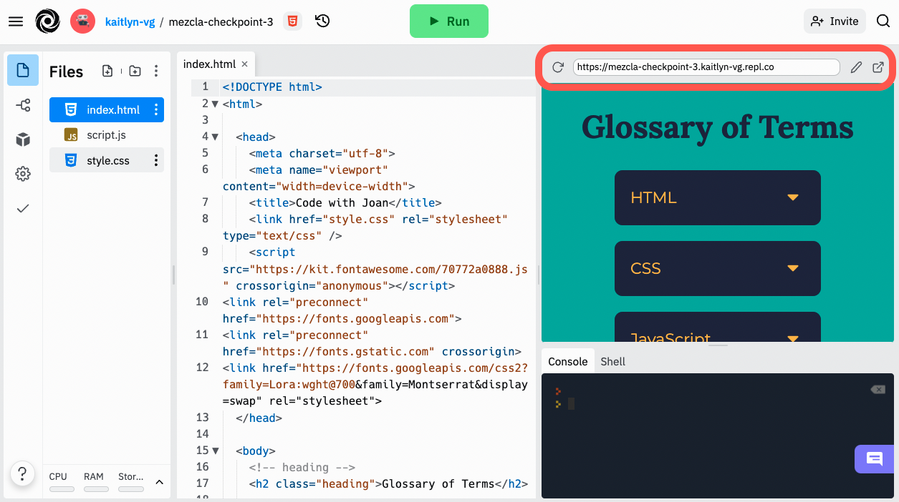

<a href="../">Back to Setup Page</a>

# Wrap-Up

You did it! 🎉 Thank you so much for spending your day with us. I hope that thinking about your reason for why you came, you feel like this time was well-spent and you gained some new knowledge, whether that's about code, Turing, or even yourself!

<strong>Please share about your experience, and how we can best support you moving forward, by completing <a target="blank" href="https://forms.gle/UuK9XBgMKFWxKGu77">this survey</a>.</strong>

## Share It!
One final step... let's make sure everyone can find the link to share your interactive page with the world.

You can find the live URL above the "mini-browser". Copy and paste the link, or click the button in the far-right to open it in a new tab.

<strong>Bonus points if you share on social media and tag Turing!</strong>
- <a target="blank" href="https://www.instagram.com/turing_school/">Instagram</a>
- <a target="blank" href="https://www.facebook.com/turingschool/">Facebook</a>
- <a target="blank" href="https://twitter.com/turingschool">Twitter</a>
- <a target="blank" href="">LinkedIn</a>

## Next Steps
<strong>Are you in love with coding?</strong> Here are a few ideas to continue your learning:
- Today you participated in a Front End Focused Try Coding Workshop. If you'd like to explore Back End or are interested in learning more about Turing School, <a target="blank" href="https://turing.edu/try-coding">please join us for one of the following events coming up</a>!
- Check out free resources for continuing to learn JavaScript on <a target="blank" href="https://www.codecademy.com/catalog/language/javascript">codecademy</a>.
- <a href="https://go.oncehub.com/LaunaGardner1" target="blank">Set up a time to meet with Launa</a> about what that could look like for you at Turing or send her an email at <strong>launa@turing.edu</strong>.
- <a href="https://apply.turing.edu/" target="blank">Start your application</a> to join us as a full-time student.

<a href="../">Back to Intro page</a>
