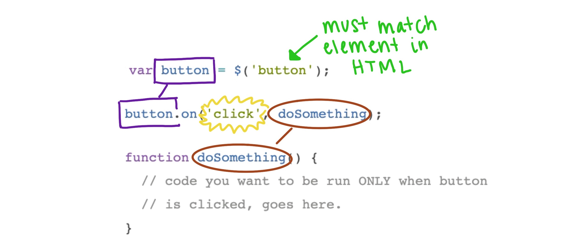

### Go Back

- [Welcome & Setup](../)
- [What is Front End Engineering?](../what-is-fee)
- [HTML Introduction](../html-intro)
- [Introduction to CSS](../intro-to-css)
- [JavaScript Fundamentals](../js-1)

# Connecting HTML & JavaScript

To get all the fun and important interactions on a page, we have to connect the specific parts of HTML that allow interactions to JavaScript!

>Note: We will be using jQuery, a JavaScript library, to assist us in completing some of the tasks that follow. If you create your own CodePen at any point, make sure to [add jQuery to the pen in order for it to work!](https://blog.codepen.io/documentation/using-javascript-libraries/)

## Accessing HTML from JavaScript

Let's look at [the code in this Replit](https://replit.com/@turingschool/connect-js-html#index.html), also typed out below, to learn how to start the "conversation" between HTML and JavaScript.

```html
<!-- HTML code -->
<p>This is a paragraph</p>
<button class="submit">A button!</button>
```

```js
// JavaScript code
var paragraph = $('p');
console.log(paragraph.text()); //console will say "This is a paragraph"

var button = $('.submit');
console.log(button.text()); //console will say "A button!"
```

## Changing HTML from JavaScript

Displaying the information that's already on the page, in the console, is not all that helpful. It was just a stepping stone. The next step is learning how to _change_ the text inside an HTML element from our JavaScript code.

<div class="try-it-new">
  <h2>Apply & Explore</h2>
  <p>Using the Replit you just forked:</p>
  <ol>
    <li>Add an <code>h1</code> element to your <code>index.html</code> file with text of your choice.</li>
    <li>In your <code>index.js</code> file, create a variable that stores the <code>h1</code> element.</li>
    <li>On the next line, type something like: <code>variableName.text('new text');</code>, using the variable name you selected and any text you'd like to see in the browser.</li>
    <li>Look in the mini-browser - it should display the text you typed in that last line of code!</li>
  </ol>
</div>

## Listening for Button Clicks

The work we've done still may not seem too exciting though; what's the point? It was another stepping stone. This final section will help us put it all together with **event listeners**. Before we learn the specifics of the code, let's contextualize it with a real life situation:

Imagine that you’ve just ordered food from GrubHub and are waiting for it to arrive. When the doorbell rings, you’ll stand up from the couch, walk over to the door, open it, and take your food. Guess what? You programmed yourself with an event listener.

In JavaScript, an event listener is a way to set up code to run only when a very specific thing happens. You’ll give instructions to the program to listen for a mouse click on a specific element on the page. When that element is clicked, the program will call a specific function for you.

```js
var button = $('button');

button.on('click', doSomething);

function doSomething() {
  // code you want to be run ONLY when button
  // is clicked, goes here.
}
```

<div class="expander expander-lesson">
  <header>
    <h2 class="spicy-click">Visualize The Connections</h2>
    <div><button class="expander-btn"></button></div>
  </header>
  <div class="hide">
    
  </div>
</div>

<div class="try-it-new">
  <h2>Next Level</h2>
  <p>For this challenge, you'll use the same Replit you used for the previous one! In the previous challenge, you changed the title, but it happened on page load, so it wasn't very exciting.</p>
  <p><strong>Your Challenge:</strong> Combine the two new pieces of knowledge/skill you have to change the title only when the button is clicked. A hint is provided at the bottom of the JavaScript file, if you'd like to use that!</p>
</div>

## Connecting HTML & JavaScript Summary

- JavaScript can "talk to" the elements in HTML.
- This communication can allow us to write programs that will listen for button clicks and change text on the page.


### Up Next

- [Building Dynamic User Experiences](../js-3)
- [Extensions](../extensions)
- [Wrap-Up](../wrap-up)
