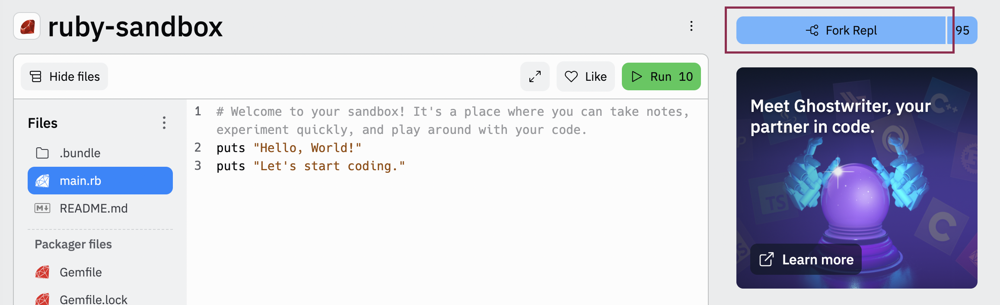
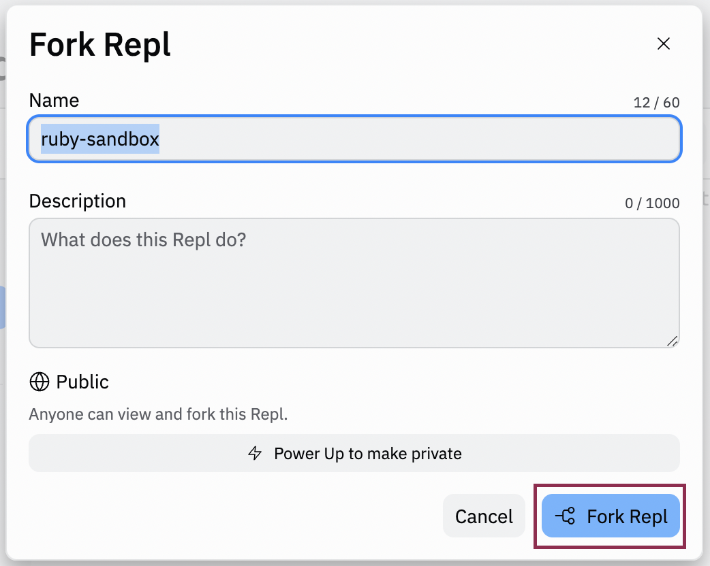

### Go Back

- [Welcome and Introductions](../)
- [What is Programming?](../what-is-programming)

# Ruby Introduction

Ruby is a dynamic, open-source programming language widely known for its simplicity. It has an intuitive syntax that is natural to read and comparatively easy to write.

## Goals

- Use the replit interface comfortably
- Identify the difference between puts and print
- Create variables to store data
- Prompt a user to enter an input value and use that value in your program

## Forking Your First Replit

Replit is a web-based interactive development environment or IDE. It allows us to write code and see the output in the console at the same time. To get started today, we will be working in <a href="https://replit.com/@turingschool/ruby-sandbox#main.rb" target="_blank">this Ruby sandbox replit</a>. When you open this replit, click the blue "Fork Repl" button to make your own copy on your account. From here, you can add code or delete code as much as you like. It's yours!





A sandbox is a place where we can play around with code! Use this space to take notes or try things throughout the workshop today.

## puts vs. print

In your sandbox replit, complete the activity that follows.

<div class="try-it-new">
  <h3>Try It: Exploring puts vs. print</h3>
  <p>Read the Ruby code and then run it.</p>
  <p>Next, change both instances of <code>puts</code> to <code>print</code>. Observe the change in output. What does that tell you about the job that each command has?</p>
</div>

<div class="expander expander-lesson">
  <header>
    <h3 class="spicy-click">Takeaways</h3>
    <div>
      <button class="expander-btn">
          
      </button>
    </div>
  </header>
  <div class="hide">
    <ul>
      <li><code>print</code> and <code>puts</code> are both <code>commands</code> that are built into the Ruby language</li>
      <li><code>print</code> will print the value it is instructed to print, but does <strong>not</strong> add a line break after printing the data</li>
      <li><code>puts</code> also prints the value it is instructed to print; but it <strong>will</strong> create a line break after printing the data</li>
    </ul>
  </div>
</div>
<br>

## Variables

In order to store a piece of data and reference it later, possibly many times throughout our code, we need to use variables. You can think of a variable like a storage container with a label on it where we can hold items we care about. In Ruby we define variables by typing the name of the variable we wish to create, followed by the assignment operator, and then the value we want to store in that variable.

When working with Ruby, we use <code>snake_case</code> for any variable names, meaning all characters should be lowercase with multiple words separated by underscores.

```ruby
email = "helloworld@gmail.com"
first_name = "Kaitlyn"
location = "Austin, TX 🦇"
```

<div class="try-it-new">
  <h3>Try It: Variables in Ruby</h3>
  <p>Back in your sandbox replit, declare three variables that describe yourself. Use <code>puts</code> or <code>print</code> followed by each variable name to confirm that you’ve done this correctly!</p>
</div>

## Data Types

In Ruby, your data (information) can be different types. There are two data types we will be working with today: Integer (any whole number), and String (words or phrases like "Ruby is fun!"). We use the Integer data type if we are storing data that may be manipulated in some way. We use the String data type if our data needs to remain consistent. With String data, anything inside of the quotation marks is preserved.

<div class="module-card fe-project-card">
  <h3>Deciding on a Data Type</h3>
  <p>For each item listed below, determine which data type is most appropriate for the information.
  <ul>
    <li>Username</li>
    <li>Age</li>
    <li>Zip Code</li>
    <li>Balance on a bank account</li>
    <li>Caption for an image</li>
  </ul>
  </p>
</div>

<div class="try-it-new">
  <h3>Try It: Data Types</h3>
  <p>Back in your replit, add two more variables assigned to Integer values. Use puts or print to verify that the data was stored in the variable as expected!</p>
</div>

## User Input

Our programs haven’t been very exciting so far because we already know what will happen just by looking at the code. What if your program incorporated dynamic input from the user?

**Explore**

1. <a href="https://replit.com/@turingschool/ColdPowderblueMeasurements" target="blank">Read the code in this replit</a> and *guess* what it will do. It is also available below, if you prefer to preview it here.
2. Run the program. It's interactive! Be ready to type in your answers in the console area.

<iframe frameborder="0" width="100%" height="600px" src="https://replit.com/@turingschool/Getting-User-Input?lite=true"></iframe>

<div class="expander expander-lesson">
  <header>
    <h3 class="spicy-click">Takeaways</h3>
    <div>
      <button class="expander-btn">
          
      </button>
    </div>
  </header>
  <div class="hide">
    <ul>
      <li>Instead of manually typing in every value, we can collect values from our user to provide a dynamic experience.</li>
      <li>When the code is run, it will stop at <code>gets.chomp</code> and wait for the user to type input into the console.</li>
      <li><code>gets</code> collects a string from the console and <code>chomp</code> removes the final character which is the enter/return.</li>
    </ul>
  </div>
</div>
<br>

<div class="try-it-new">
  <h3>Try It: Getting User Input</h3>
  <ol>
    <li>In your sandbox replit, write a small program that asks the user for their name and responds with a sentence of your choice!</li>
    <li>Now, add on to your program and ask your user two more questions. If you’re not feeling creative, ask them how they are feeling today or their best friend’s name! Try running your program a few times with different values stored in the variables each time.</li>
  </ol>
</div>

### Up Next
- [Ruby Methods](../ruby-methods)
- [Control Flow](../control-flow)
- [Loops](../loops)
