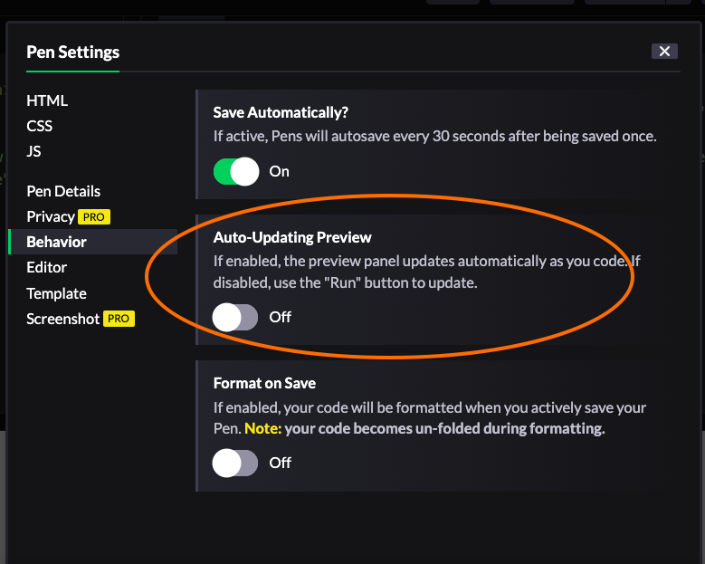

# LGBT Tech x Turing: Try Coding Workshop

In this live, instructor-led workshop, you will build a magic eight ball app! 

_This will be best experienced on a desktop or laptop computer._

## Welcome!

We are so glad you are here! To get set up...
1. You will need a <a target="blank" href="https://codepen.io/">CodePen</a> account. Go ahead and get signed up (it's free!).
2. Please change your zoom name to first, last initial, and pronouns, like this: _Kayla G. (she/her)_. Not sure how to do that? Hover over your image in the zoom gallery, click the three dots, and select Rename.
3. Heads up! We will ask you to briefly introduce yourself in a minute.
 

## Goals

- Build and customize a magic eight ball app
- Gain _exposure_ and familiarity with some HTML, CSS, and JavaScript
- Demystify software development and determine if coding is something you want to pursue further
 

## Learning Norms

- No question is too small and no question is a bad question. Ask them!
- We all benefit from each other's ideas! Push yourself to share at least one time today.
- Keep your camera on during the session (if you can).
- **Questions?** Type into the zoom chat, raise your hand, or come off of mute! Please avoid direct messages unless it is a specific issue only to yourself.
- **Disconnected?** Jump back on!
 

## Zoom Practice

There are several ways to get my attention throughout the workshop today. Let’s practice using some of these tools now.
- **Type in the chat to everyone.** What is your favorite cereal?
- **Send the instructor a direct message.** What word describes how you are feeling today?
- **Raise your hand.** Find your zoom toolbar, click Reactions, then Raise Hand.
- **Introduce yourself!** Share your name, pronouns, and something you're hoping to get out of this workshop.

## Be Nice to Yourself

This might be your very first day working with code. Learning is often uncomfortable and things are bound to break. When this happens, there are few things you can check first:
- Did you spell everything correctly? Capitalization matters!
- Do you have closing symbols for every opening symbol? Every opening bracket needs a matching closing bracket.
- Do the colors follow a predictable pattern? If the colors are consistent and then all of the sudden change, it could be a clue that something isn't quite right.
 

## Project Set Up

We will work off of a starter kit that has already been created.
1. <a target="blank" href="https://codepen.io/turing-trycoding/pen/MWzGQJb">Click this link to access the starter kit</a> in CodePen.
2. Click the <code>Fork</code> button at the bottom right of the page to make a copy you can edit and save. If you haven't logged in/signed up yet, it will prompt you to do so. After you fork, you should see YOUR NAME in the top left corner under the title of the project.
3. Update your settings so that you have a `Run` button: Settings > Behavior > toggle Auto-Updating Preview to OFF
  

## Up Next

- [Overview](./overview)
- [HTML](./html)
- [CSS](./css)
- [JavaScript](./javascript)
- [Wrap-Up](./wrap-up)