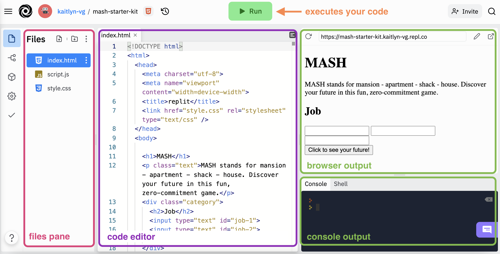

# Weekend Workshop: Build a MASH App

## Day 1: Build an Almost-MASH App
Remember MASH? That silly game we played as kids that would predict your future? In this live, instructor-led workshop, you will build your very own modern MASH web application to share with friends and family! Let go of all your planning to be a better version of yourself in 2022 and let MASH decide your future for you. Don’t know what I’m talking about? Watch <a target="blank" href="https://www.youtube.com/watch?v=vFPxE3KnVro&t=4s">this short video</a> to see how the game of MASH is played.

_This will be best experienced on a desktop or laptop computer._

## Welcome

We are so glad you are here! To get set up...
1. Open up <a target="blank" href="https://replit.com/~">repl.it</a> in a browser (preferably Chrome) and log in to your account.
1. Please change your zoom name to first, last initial, pronouns (ex: _Amy H. (she/her)_). To do this, hover over your image on zoom, click the three dots and select “Rename” from the menu.
1. Heads up! We will ask you to briefly introduce yourself in a few minutes.
 

## Goals
- Build and customize a <a target="blank" href="https://replit.com/@turingschool/mash-checkpoint-6#script.js">digital MASH application</a>
- Gain _exposure_ and familiarity with HTML, CSS, and JavaScript
- Determine if coding is something you enjoy doing and want to pursue further

_Disclaimer: We won't become experts in these languages today. And you may leave with more questions than answers!_
 

## What to Expect
Over the course of two days, we will write code, practice the habits of successful developers, and learn a little more about Turing. Challenge yourself over the next two days to ask questions and get the most out of this experience. 
- Welcome and Setup (45 minutes)
- Instruction (1 hour and 15 minutes)
- Turing Info Session (1 hour)
- Instruction and Wrap-Up (2 hours)

## Zoom Tools and Introductions
- Reactions - Raise your hand if a friend or family member recommended Turing to you!
- Chat - Would you rather have a professional chef or housekeeper?
- Intros - name, pronouns, location, why you are here!

Want to get my attention during the workshop? Raise your hand, type your question in the chat, or just come off mute and ask!

## Online Learning Norms
- Ask your questions and share your code!
- Mute your microphone unless you’re the main speaker.
- Keep your camera on during class.
- Disconnected? Jump back on! The host or TA will resume the session shortly.

## What is Front End Engineering?

Building the user-facing part of a website or app is referred to as Front End Engineering. Building the Front End of a web page requires writing code in three programming languages, and making the code in each language “talk to” the code in the others.

It can feel like a lot, but let’s start by building an understanding of what each language is responsible for. We will make some comparisons to the human body to create context.

<section class="data-type-cards language-cards">
  

    <h3>HTML</h3>
    
HTML holds the content we see on a page (text, images) and defines the structure and order in which the content appears.

    
We can think of HTML as the skeleton of our webpage; without it, we'd just be a blob:

    
  

  

    <h3>CSS</h3>
    
CSS defines the look and feel of a webpage - it can change the size or layout of items on a page, change colors, fonts, and more!

    
We can think of CSS as anything that makes us unique and recognizable - our skin, hair, clothes, style, etc.

    
  

  

    <h3>JavaScript</h3>
    
JavaScript is what lets the user interact with a page. For example, clicking a button and getting some sort of response.

    
We can think of JavaScript as the brain and muscle of our webpage, as it powers all the action:

    
  

</section>
  

## Project Setup

We will work off of a starter kit that has already been created. Click [this link to access the starter kit](https://replit.com/@turingschool/mash-starter-kit#index.html) in replit. Below, you’ll see an image outlining the different tools available in the replit interface.

Here's how to get set up:
1. Click the blue `Fork repl` button in the top right corner to make a copy of the starter kit for yourself.
1. Change the description of the game on line 12 to something different.
1. Click the green `Run` button at the top of the page and you should see that description appear!

In the next part of the lesson, we will explore the HTML file to understand the “bones” of this app.

 

## Now, it gets even more fun:
- [HTML - Content](./html)
- [JavaScript - Overview](./js-1)
- [JavaScript - Behavior](./js-2)
- [Day 1 Review](./review)
- [JavaScript - Capture User Input](./js-3)
- [JavaScript - Conditionals](./js-4)
- [CSS - Styles](./css)
- [Wrap-Up](./wrap-up)