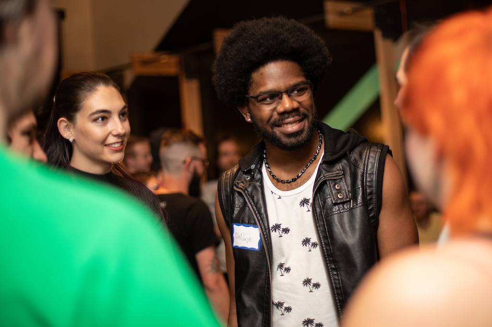

<a href="../">Back to Setup Page</a>

# Thank You!
Thank you for spending your time with us today. We hope you enjoyed this introduction to coding. Please take a moment to share about your experience, and how we can best support you moving forward, by completing <a href="https://docs.google.com/forms/d/e/1FAIpQLScX3FExQv0xJ3MBOfrkheqlhcwc3c-E6PKjivL-7mA8s3K05Q/viewform" target="blank">this survey</a>.

<strong>Are you in love with coding?</strong> Keep reading for a few ideas to continue your learning.

## Join Us As A Student
If you enjoyed your time today and you think Turing might be the place for you, we’d love for you to apply today!

<section class="image-section" style="outline:none; width:50%)">

</section>

<button class="apply-today-btn"><a href="https://turingschool.my.site.com/ApplicantPortal/s/login/SelfRegister" target="blank">Apply Today!</a></button>

- July Cohort
  - Apply by June 2
  - July 3 Start Date
- August Cohort
  - Apply by July 17
  - August 21 Start Date
- October Cohort
  - Apply by September 4
  - October 9 Start Date

## Scholarships
Turing offers two $10,000 <strong>BIPOC & Inclusion</strong> scholarships every cohort. As a special thank to our partnership we also offer a <strong>Partnership Scholarship</strong> that is awarded as a $2,500 tuition discount exclusively for our Try Coding Partnership workshop attendees (that’s you!). Make sure to apply within 30 days of today & the discount will be automatically applied!

<strong>If you'd like to meet with Tamika, our Financial Aid Coordinator, <a href="https://go.oncehub.com/tamikaatturing" target="blank">schedule a time to meet with her today</a>!</strong>

## Continue Learning
- If you'd like to explore more coding workshops with Turing School, <a target="blank" href="https://turing.edu/try-coding">please join us for one of the following events coming up</a>!
- Check out free resources for continuing to learn JavaScript on <a target="blank" href="https://www.codecademy.com/catalog/language/javascript">codecademy</a>.
- We have another <a href="https://www.eventbrite.com/e/turing-alumni-panel-tickets-636824558397" target="blank">Alumni Panel</a> coming up on May 4. 
- If you're interested in learning more about Turing, please email <strong>admissions@turing.edu</strong>.

## Thank you!
As we wrap up our time together, we want to thank you for spending your time with us. 

 
 
 