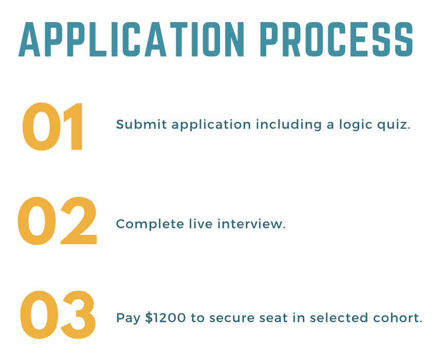

<a href="../">Back to Setup Page</a>

# Closing
Thank you for spending your time with us today. We hope you enjoyed this introduction to coding and the conversation we had with our students and alumni. <strong>Are you in love with coding?</strong> Keep reading for a few ideas to continue your learning.

## Continue Learning
- If you'd like to explore more coding workshops with Turing School, <a target="blank" href="https://turing.edu/try-coding">please join us for one of the following events coming up</a>!
- Check out free resources for continuing to learn JavaScript on <a target="blank" href="https://www.codecademy.com/catalog/language/javascript">codecademy</a>.

## Learn More About Turing
- We have another <a href="https://www.eventbrite.com/e/turing-alumni-panel-tickets-619440211347?_eboga=UA-103295514-1" target="blank">Alumni Panel</a> coming up on May 4. 
- <a href="https://go.oncehub.com/CristalTorresLopez" target="blank">Set up a time to meet with Cristal</a> about what that could look like for you at Turing or send her an email at <strong>cristal@turing.edu</strong>.

## Join Us As A Student
If you enjoyed your time today and you think Turing might be the place for you, we'd love for you to <a href="https://apply.turing.edu/" target="blank">join us as a full-time student</a>.

- July Cohort
  - Apply by April 24
  - July 3 Start Date
- August Cohort
  - Apply by June 12
  - August 21 Start Date
- October Cohort
  - Apply by July 31
  - October 9 Start Date

We are offering a $2,500 tuition discount exclusively for our Try Coding Partnership workshop attendees (that's you!) and we also offer <a href="https://turing.edu/financing/scholarships" target="blank">two $10,000 scholarships</a> for each cohort. If you'd like to meet with Tamika, our Financial Aid Coordinator, use the QR code below to schedule a meeting.

## Thank you!
As we wrap up our time together, we want to thank you for spending your time with us. Please take a moment to share about your experience, and how we can best support you moving forward, by completing <a href="https://docs.google.com/forms/d/e/1FAIpQLSdw1p2ey9d88VJ3-U-yXiaU411fc7zyG7Pd1AoTl3CzOYjL9Q/viewform" target="blank">this survey</a>.