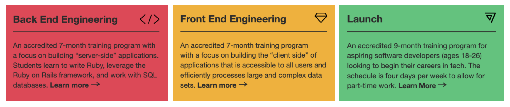

# Try Coding x Turing School: HTML and CSS 

In this live, instructor-led workshop, you will start the process of building an interactive webpage with interactive buttons that hide and reveal information.

_This will be best experienced on a desktop or laptop computer._

## Welcome!
We are so glad you are here! To get set up...

Please change your zoom name to first, last initial, and pronouns, like this: _Brandi G. (she/her)_. Not sure how to do that? Hover over your image in the zoom gallery, click the three dots, and select Rename.

## Who is Turing?
> Our mission is to unlock human potential by training a <strong>diverse and inclusive</strong> student body to succeed in high fulfillment technical careers.

<a href="https://turing.edu/" target="blank">Turing School of Software & Design</a> is an industry-leading and accredited training program for software developers. Our student outcomes are built through collaboration across a dedicated community of students, instructors, mentors, and job coaches.
- 100% guided remote instruction
- 80% graduation rate
- 91% gainfully employed
- 80k median salary for new graduates

<strong>Our vision is a world powered by technology where the people building it represent the people using it</strong>. It is with this vision in mind that we decided to partner with <a href="https://latinasintech.org/" target="blank">Latinas in Tech</a> for this event.

## Our Programs

## What to Expect Today
- Welcome and Introductions (10 minutes)
- Session Norms and Setup (20 minutes)
- Instruction (50 mins)
- Wrap-Up (10 minutes)
- Alumni Panel (25 minutes)
- Closing (5 minutes)

### Now, it gets even more fun:
- [Introduction](./intro)
- [HTML - Content](./html)
- [CSS - Styles](./css)
- [Wrap-Up](./wrap-up)
- [Closing](./closing)

<section class="image-section" style="outline:none; width:50%)">

</section>
