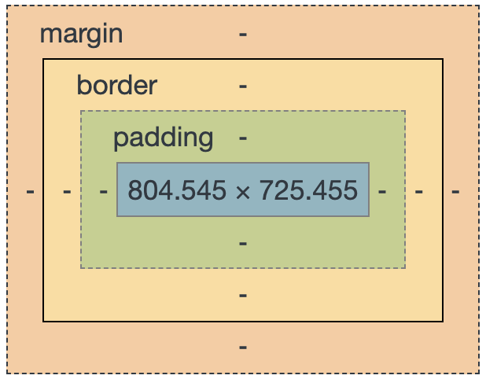

<a href="../">Back to Setup Page</a>

# CSS - Explore to Learn

CSS allows us to "dress up" the content on our page. Let's demonstrate what CSS is currently doing for the rocket app we all started with. 

This [Chrome extension](https://chrome.google.com/webstore/detail/disable-html/lfhjgihpknekohffabeddfkmoiklonhm/related) allows us to toggle the CSS with the click of a button! Let's explore a few of our favorite sites _without_ CSS.

## Tour the Existing Code

- CSS allows us to target types of elements (ex: `div`) and specific elements with a class name (ex: `.moon`)
- Once we've targeted an element, we can write rules for that element to follow. Rules can be things like _"the background color should be grey"_ or _"there should be X amount of space between this element and the edge of the page"_.

### Explore to Learn:

After you complete each task that follows, re-run the program and observe the changes in the browser! If you like the change - leave it. If not, change it back.
- On line 2 of the CSS file, change `blue` to `#191931`, then to `#191991`
- On line 9, change `10%` to `60%`
- On line 9, change `15%` to `85%`
- On lines 10-11, change `80px` to any other number, followed by `px`

You may be wondering, "how does one know all these special keywords and commands to create these rules?". Great question! With time and practice, and the use of documentation like [MDN](https://developer.mozilla.org/en-US/docs/Web/CSS) and [CSS Tricks](https://css-tricks.com/), developers slowly build their toolkit. Even the most experienced developers need to continually research and google to find the tool they need.
 
 

### Common Property Breakdown

While exploring, you probably made some deductions about what some properties do for us. Let's review to make sure everyone has an understanding:
- `background`, hex codes (find great color resources [here](https://htmlcolorcodes.com/color-picker/) and [here](https://coolors.co/13536f))
- `height` and `width`
- `margin`
- `border`

  <h2>Modify the Existing Code</h2>
  
Now that we can see how some of the pieces come together with CSS, let's continue in this process of "making it our own".

  
<strong>Adjust the colors of the sky, ground, moon and rocket pieces to your liking!</strong>

  
<strong>Change the size of your moon.</strong>

  
<strong>Change the height of the ground; and then you'll probably want to adjust where you rocket "sits" accordingly.</strong>

  
<strong>Want to change the size/dimensions of your rocket? Adjust widths, heights, and margins of one, some, or all of the 5 pieces of the rocket.</strong>

  
Play around with these rules until you are satisfied with your rocket and scene!

  
<em>🌟 Remember: we are very much still here to explore-to-learn - you are not expected to be an expert!</em>

## CSS Summary

- CSS allows us to target an element or class and write specific rules for it to follow
- Based on the type of rule, CSS will expect different values (ex: `magenta` for a color and `10px` for a measurement)
- There are many types of rules we can write; with practice, we become familiar with more but don't need to memorize them all

<a href="../an-1">Next Section: Animations 101</a>
