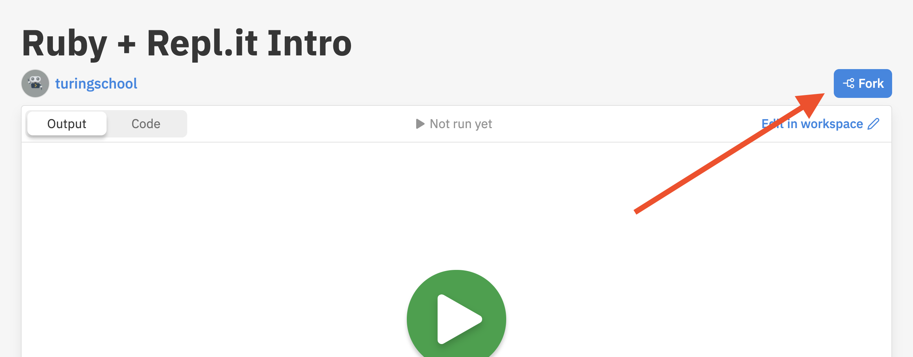

# Ruby for Newbies

In this live, instructor-led workshop, you will build and customize your very own computer program while learning the fundamentals of Object-Oriented Programming!

_This will be best experienced on a desktop or laptop computer._

## Welcome!

We are so glad you are here! To get set up...
1. Open up <a target="blank" href="http://repl.it/">repl.it</a> in a browser (preferably Chrome) and log in to your account
1. Please change your zoom name to first, last initial, pronouns -- like this: _Brandi G. (she/her)_. To do this, hover over your image on zoom, click the three dots and select “Rename” from the menu.
1. Heads up! We will ask you to briefly introduce yourself in a few minutes.
<br><br>

## Goals

- Explain the core concepts of Object-Oriented Programming
- Gain _exposure_ and familiarity with the Ruby syntax for classes and instances
- Determine if coding is something you enjoy doing and want to pursue further

Disclaimer: We won't become experts in Ruby or Object-Oriented Programming today. And you may leave with more questions than answers!
<br><br>

## Zoom Tools and Introductions
- Reactions - Raise your hand!
- Chat - Are you an early bird or a night owl?
- Intros - name, pronouns, location, why you are here!

Want to get my attention during the workshop? Raise your hand, type your question in the chat, or just come off mute and ask!

## Programming Concepts We Will Use

Back End Engineering is concerned with the management of data for an application. There are different ways we can structure the data itself as well as the systems that manage it. Object-Oriented Programming (OOP) is one way to design a program to manage the data in a Back End.

OOP is not exclusive to Ruby! In fact, many of the most widely used programming languages follow the patterns of OOP, including Java, C#, and Python.

<section class="data-type-cards language-cards">
  <div>
    <h3>Ruby</h3>
    <p>Ruby is the programming lanugage we will write in today, to give instructions to the computer. It's known to be a beginner friendly language because of it's syntax and similarities to the English language!</p>
  </div>
  <div>
    <h3>OOP</h3>
    <p>Object-Oriented Programming (OOP) is a programming paradigm that we can use with many lanuages, including Ruby and Python. It focuses on writing reusable code.</p>
  </div>
</section>
<br><br>

## Brief Ruby + repl.it Intro

To gain some familiarity with repl.it, the interface we will use to write code in today, and start looking at some Ruby code, click <a target="blank" href="https://repl.it/@turingschool/Ruby-Replit-Intro#main.rb">this link</a>. To start, you'll first need to click the blue "Fork" button.



1. Change the text `NAME` on line 2 to your name
1. Click the green run/play button at the top center of the page

<div class="try-it-new">
  <h2>Write some Code!</h2>
  <p>Now that we've seen what variables can do and how to run our code, let's add on to what is existing. Write at least 2 more variables under line 2. Print all variables out, and re-run the code to make sure they are working as expected!</p>
</div>

## Data Types

For different types of information, we might choose a different `Data Type`. Here are 4 common data types in Ruby: 
- **String:** Any series of characters (alpha, numeric, or symbol) between quotation marks
- **Integer:** Any whole positive or negative number, including 0
- **Float:** Any positive or negative number that involves a decimal
- **Boolean:** `true` or `false`

<div class="try-it-new">
  <h2>Deciding on a Data Type</h2>
  <p>For each piece of information below, decide which Data Type you would use to store that information.</p>
  <ul>
    <li>Username/handle</li>
    <li>Age</li>
    <li>Number of Likes</li>
    <li>Balance on a bank account</li>
    <li>Active status</li>
    <li>Daily countdown to a big event</li>
    <li>Phone number</li>
  </ul>
</div>

## Best Practices for Naming Variables

Naming can be hard, but is important to be thoughtful about and follow conventions of the language you are working with so that your code is easily accessible and readable for those you are collaborating with. A few key points:
- All Ruby variables should use `snake_case` - all characters should be lower cased; in multi-word variables, words should be separated with an underscore.
- Variable names should describe the type of data they hold without being overly verbose or specific (examples: `name`, `email`, etc. non-examples: `x`, `ftga23`, `name_of_incoming_mod_1_back_end_student`).

<div class="try-it-new">
  <h2>Try It</h2>
  <p>In your replit, add variables until you have at least one of each data type. Be ready to share your code!</p>
</div>

## Reassigning Variables

We often need to write code that changes the data stored in a variable. Consider the example of the `active_status` variable from earlier in the lesson. When a user is online, the `active_status` value will be `true`, but if that user signs off, that value needs to be updated to `false`. Reassigning the value of a variable looks something like the code below.

```ruby
active_status = true
puts active_status # true

active_status = false
puts active_status # false
```

<div class="try-it-new">
  <h2>Try It</h2>
  <p>Back in your replit, reassign 2-3 of your variables to new values and print their values to the console to observe the output.</p>
</div>


## Now, it gets even more fun:
- [Connecting OOP to Real-World Scenarios](./oop)
- [Writing OOP Code](./oop-code)
- [Build your Own Class](./byoc)
- [Wrap Up](./wrap-up)
