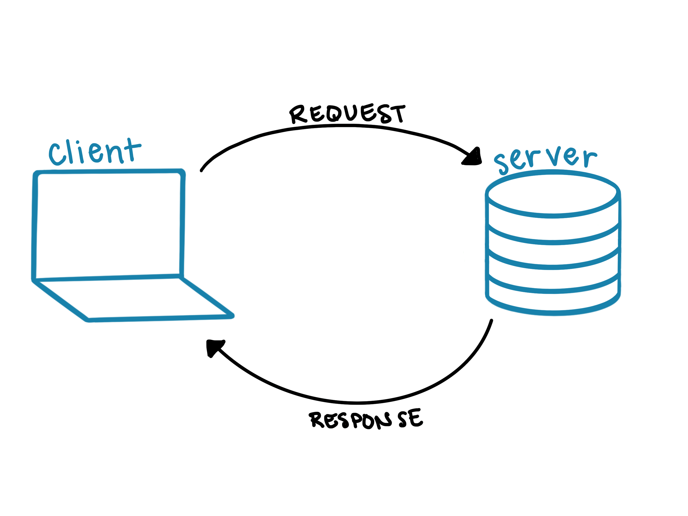
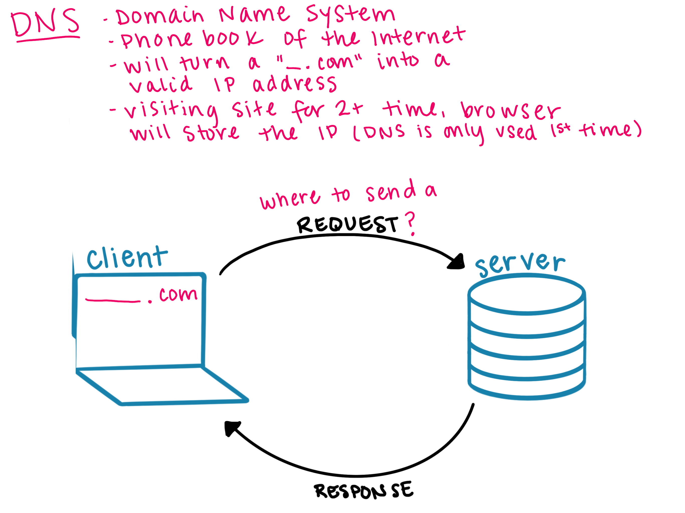
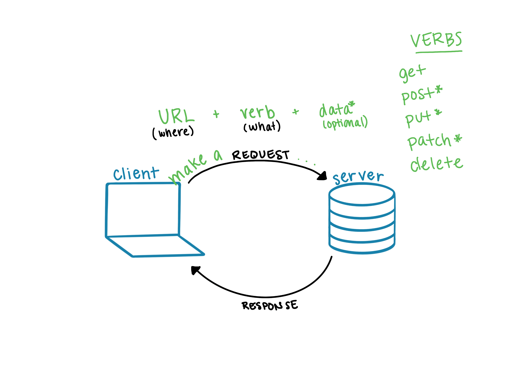
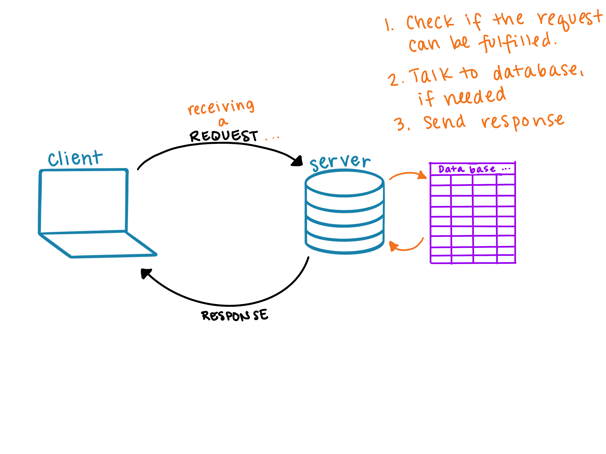
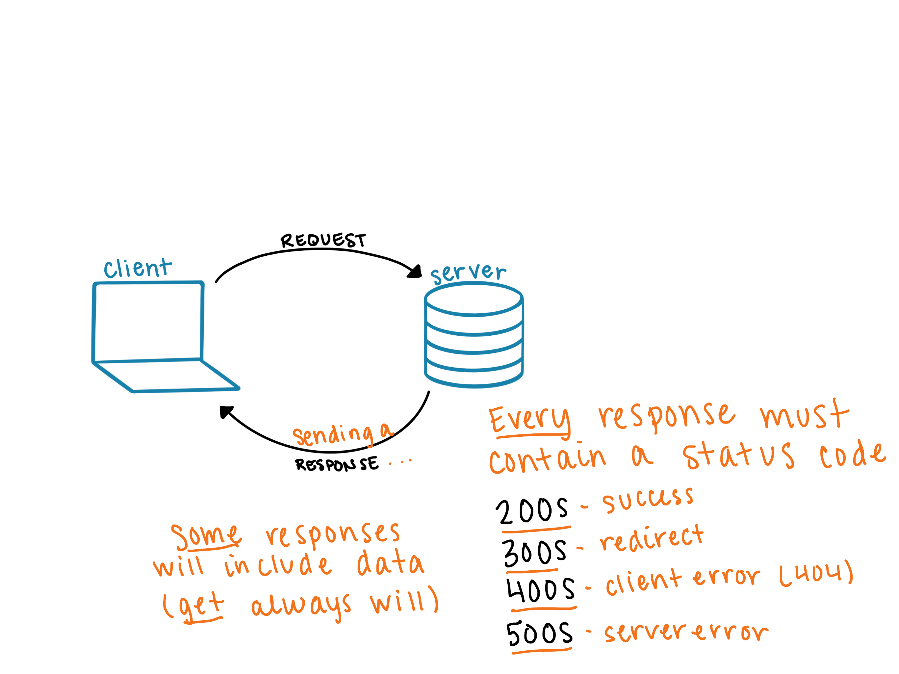
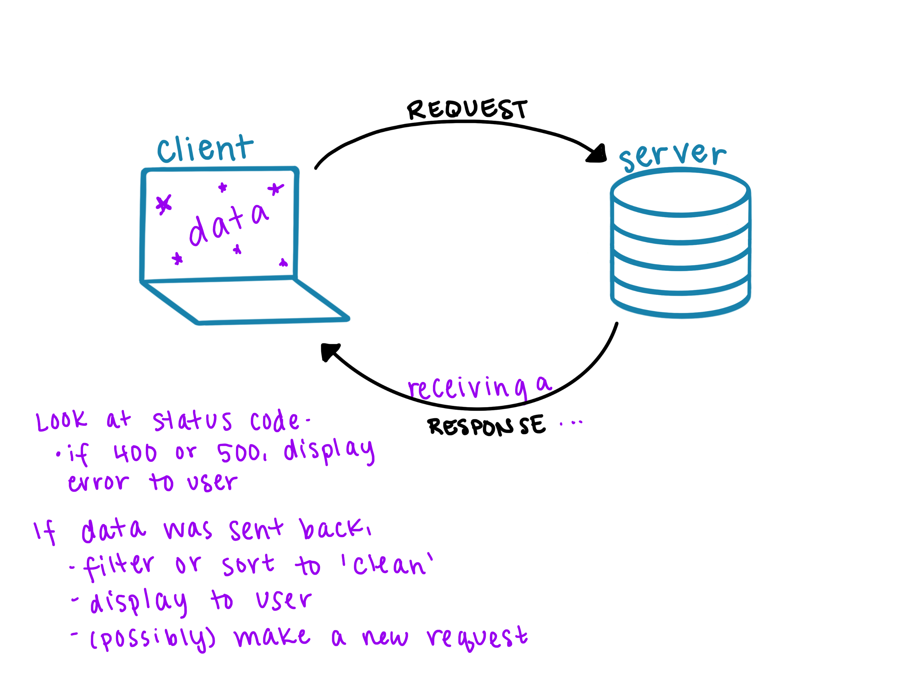
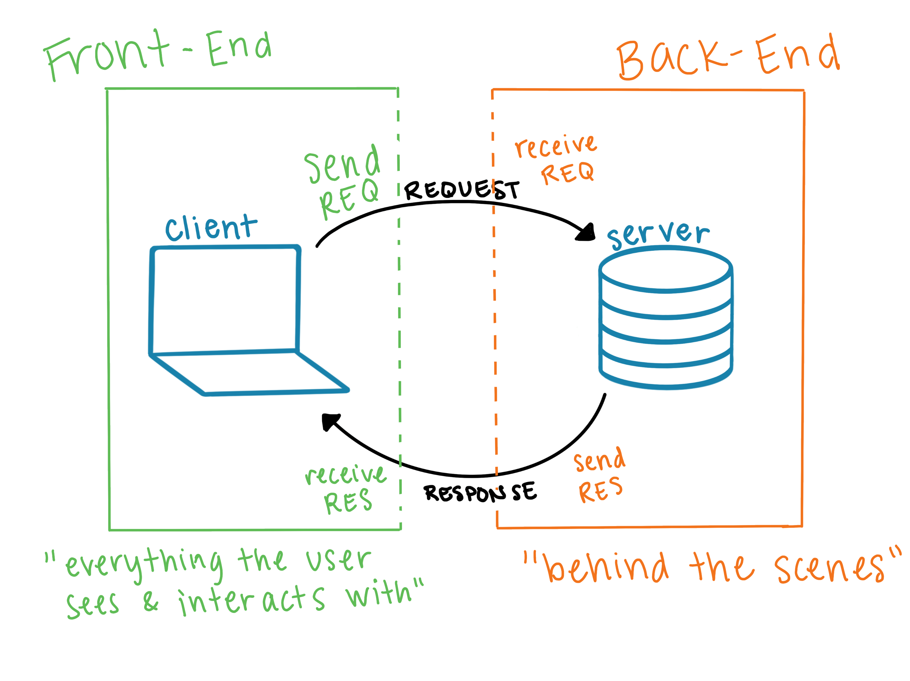

# Workshop 1: How the Web Works

<a href="../">Back to Series Page</a>

## Connecting to our Our Experiences

While this workshop will be more of a lecture style than interactive, let's start off with connecting some fundamentals about the web to your lived experiences as a user of it!

  <h2>Share Out</h2>
  
What are all the devices you have accessed the internet with?
  

## Client

All of the devices you just listed out will be referred to as **clients** moving forward. You as the human are not the client, but the _device_ is.
  

  <h2>Share Out</h2>
  
What are some of the websites or apps you regularly visit?
  

## Server

All of those websites and apps you just listed are tied to a certain location, and at that location, they have a **server** that holds all the information that that site may potentially give you.
  

## HTTP

You've probably seen `http` and `https` a million times. It stand for **hypertext transfer protocol** and it's the set of rules that defines how clients and servers can talk to each other. The `s` in `https` stands for secure; `https` is an extension of `http` and is used for secure communication over the web.

**Why do we need it?** Imagine this: if Amazon and Etsy had totally different ways of communicating with a client, how would the client know how to communicate or what to expect? Maybe it could be figured out, but that would likely take much more (uneccesary) time for our pages to load. HTTP keeps these processes uniform across the web, which benefits everyone.

## Request Response Cycle

The **request-response cycle** is the process of the clients and servers talking to each other. It is best understood when we can diagram it out. We'll start with a base diagram:

### How does the client know which server to send a request to?

When you type a restaurant name into the search bar of Google Maps, you can click the restaurant name that matches, then get routed there. But behind the scenes, the application looked up the actual address. 

Similarly, when you type in a URL like `etsy.com`, there is a more specific address, or location, where all of Etsy's information is stored. That is called an `IP address`. The first time you attempt to visit a site, your browser won't know where to send the request. It was ask the `DNS` (Domain Name System), which is like the phonebook of the internet, to find the IP address. Your browser will store that url and IP address pair, so that the next time you visit the site, it won't have to bother DNS.

### What should and must be in a request?

To make a request to a server, 2 things are absolutely necessary.
1. **URL/path** - now that we have the IP address, the question is "which part of this site do you want access to?". You've probably seen the long URLs once you've clicked around on sites - a short example would be `etsy.com/orders`.
1. **verb/method** - now that we're at that specific location, the question is "what does the user want to do? Do they want to see something? Delete something? Add something to their shopping cart?". The possible verbs are: 
  - get (get info to read)
  - post (create something in database)
  - put/patch (update existing info in database)
  - delete (remove from database)

If the request is to post or put/patch something, additional data must be sent along so the server knows _what_ to add or update.

  <h2>Think About It</h2>
  
Think of a recent interaction on a web application. What are some of the interactions you had, and what verbs/methods were probably associated?
  

### What does the server do once it gets a request?

The server will have a lot of code written to handle the incoming requests. Once it receives a request, that code will be read and it will be determined which portion of the code needs to be used. 

Then, that portion of the code will tell the server if it needs to talk to a database. We can think of the database as a giant excel spreadsheet. If it does, it will ask for and get the info from the database.

### What should and must be in a response?

Once the server has done everything to fulfill a request, it will package up a response. Some responses will contain data, some won't. Every response will contain a status code. 

Status codes are 3 digit numbers, the first indicating the general staus of the response. Most people have encountered the infmaous `404 - page not found`. The 400s mean client error; in this case, the client requested to see a page that does not exist or that they do not have access to. Read more about status codes, in a memorable way, [here](https://http.cat/).

### What does the client do with the response?

When the client receives a response, it too will have a portion of code instructing the program on what do to. First, it will check that the status code is in the 200s. Then, depending on the nature of the original request, it will proceed. A couple of examples:
- If a `get` request was made, there is probably new data to display to the user
- If a `delete` request was made, something probably needs to be removed from the screen, or a confirmation banner needs to appear

## Connecting Back to our Our Experiences

  
A user makes a new post on social media.
 
  
Diagram out what happens, using as much vocabulary as possible. <em>You do not have to use the same diagram as we did in class if your brain sees it slightly differently!</em>

## Back-End and Front-End Engineering

You may be wondering how Back-End and Front-End Engineering fit into all of this, or you may have some clues. 

We will go into detail in each of the upcoming Lunch 'n Learn Workshops, but at a high level, we'll end with this:

- **Front-End Engineering** involves writing all of the code on the client side. It presents the data to the user, packages up the requests and makes the requests. Once a response is sent back from the server, Front-End code "unpacks" the response and displays the relevant information to the user.
- **Back-End Engineering** involves writing all of the code on the server side. It receives the request, communicates with a database if necessary, then packages up a response and sends it to the client.

 

Next Session: <a href="../be">2: Back-End Engineering</a>