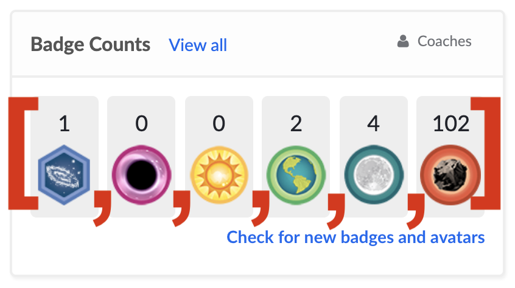

# Arrays

<a href="../">Back to Curriculum Index</a>

## Goals

- Use Ruby syntax to declare variables that store Arrays
- Explain use cases for Arrays
- Access elements by index
- Use array methods to add, remove, and shuffle elements

## Lists

Ruby provides us with a data type that can hold multiple pieces of data in a list. Imagine looking at a list of variables for each class taught in your school:

```ruby
course_1 = "Math"
course_2 = "Science"
course_3 = "ELA"
course_4 = "Theater"
# etc...
```

This would soon be a LOT of code to initially type, to maintain over time and to create opportunities for typos. This pattern would defeat the point of programming which is to automate work!

If we have a list of similar items that we want to group together Ruby gives us a way to do that which only requires one variable.

## Arrays

An Array can hold as many pieces of data as we want it to. We refer to each piece of data as an **element**. The syntax Ruby expects for these lists is as follows:

```ruby
courses_offered = ["Math", "Science", "ELA", "Theater"]
student_ids = [1456, 3287, 7610, 5711]
```

A few things to notice:
- Variable names should be plural
- Each element inside of the array is separated by a comma and one space
- All elements in the array are of the same data type (best practice but not required)

## Arrays IRL

It’s very likely that every application you’ve used - on a phone or laptop - utilized arrays in the code that built it.

We can’t see all the code that built every application, but there are some places where it’s very clear that an array would be the best tool to use. Here are some examples from sites we may be familiar with:

- [Instagram](https://www.instagram.com/alfie_the_alpaca_in_adelaide/) uses arrays to hold all the posts for a given user. Alfie the Alpaca has over 800 posts, so the array is over 800 elements long!
- [Khan Academy](https://www.khanacademy.org/) uses an Array to hold a users Badge Counts




```ruby
badge_count = [1, 0, 0, 2, 4, 102]
```

<div class="try-it-new">
  <h2>Share Out</h2>
  <p>Where might an array be used in one of the sites <em>you</em> use on a regular basis?</p>
</div>

## Access Elements

We can rely on Arrays to keep our data in order. Each element, based on it's location in the Array, is assigned an index position. In programming, numbering starts at 0, so the first element is in position 0.

<!-- make little graphic like tiktok one for KWK -->
```ruby
courses_offered = ["Math", "Science", "ELA", "Theater"]
```

The syntax to access an element is below. We instruct the program to that we want to look at the `student_names` array, then more specifically, the element at `X` position.

```ruby
courses_offered[0]
# --> "Math"

courses_offered[1]
# --> "Science"

courses_offered[2]
# --> "ELA"

courses_offered[3]
# --> "Theater"
```

<div class="try-it-new">
  <h2>Try It: Declaring Arrays & Accessing Values</h2>
  <p>In repl, declare a variable that stores an array of at least 5 elements, each being a <strong>student name</strong>.</p>
  <p>Print out the entire array, then individually print out all 5 student names to the console.</p>
</div>

## Array Methods

Similar to the `.length`, `.upcase` and other methods we briefly saw in action for Strings, there is a whole set of Array methods available to us. We'll just dive into a few in our work today, but as always, let your curiosity guide you if you want to explore more!

As we walk through each one, we will make _real world connections_ to how these methods could be used to re-create functionality seen on [Kahoot](https://kahoot.com/schools-u/). For this, let's work from a shared assumption/understanding that Kahoot stores each users Kahoots in an array.

### .count
The count method allows us to check the number of elements in the array it is called on
```ruby
courses_offered = ["Math", "ELA", "Theater"]
puts courses_offered.count
# --> 3
```

_Real world connection: Up at the top of the "Kahoots" view, a user can see the number of total Kahoots they have tied to their account._

### .pop
The pop method allows us to remove the last element from the array it it called on

```ruby
courses_offered = ["Math", "ELA", "Theater"]
courses_offered.pop

puts courses_offered
# --> ["Math", "ELA"]
```

_Real world connection: When a Kahoot ends, a 1st place winner is determined, then 2nd then 3rd and those names are displayed on the final screen. The pop method could be used three times to grab those from the array, if the array was sorted by score._

### .push
The push method allows us to add an element to the end of the array it is called on. In order to tell Ruby what element to add, we must include inside of `( )` after `.push`

```ruby
courses_offered = ["Math", "ELA", "Theater"]
courses_offered.push("Science")

puts courses_offered
# --> ["Math", "ELA", "Theater", "Science"]
```

_Real world connection: When an user creates a new Kahoot, it is pushed into the array of all Kahoots._

### Quick Recap:

- `.count` counts the total number of elements in the array
- `.push` adds an element to the end of the array
- `.pop` removes the last element from the array

<div class="try-it-new">
  <h2>Try It: Array Methods</h2>
  <p>Earlier, you delcared a variable that stores an array of student names. Below that code, write code to <strong>remove all the students in that array</strong>, one by one.</p>
  <p>Print out the array. Then, programmatically check (and print out) the length of the array.</p>
  <p>Now, <strong>add in 5 new students</strong> to the array! Print the array again out to make sure they are in there.</p>

  <div class="spicy-container">
    <p class="spicy-click">Click here for an Early Finisher Challenge!</p>
    <div class="spicy-toggle">
      <p>Look into two other Ruby methods: <code class="try-it-code">shift</code> and <code class="try-it-code">unshift</code>. You can run a google search or start with <a href="https://dev.to/ddhogan/quick-reference-for-array-methods-pushpop-vs-shiftunshift-4g7h">this resource!</a></p>
    </div>
  </div>

</div>

## Choosing a Random Element

There are myriad real world connections we can make to web or mobile apps using randomization: quote/photos of the day, shuffling the order of songs on a playlist, Kahoot will randomize the order of questions so quizzes aren't too predictable.

There are a few ways we can go about it programmatically. Let's first consider the path laid out in this _pseudo-code_:

```ruby
# 1. find the length of the array
# 2. generate a number between 0 and the number found in step 1
# 3. access the element at that index position
```

The example above works and is the main path to implementation in other languages, but Ruby is so friendly that it [built in a method that shuffles an array](https://stackoverflow.com/questions/1816378/how-to-randomly-sort-scramble-an-array-in-ruby)! Check out this simpler pseudo-code path:

```ruby
# 1. shuffle the array
# 2. access the element at index 0
```

<div class="try-it-new">
  <h2>Try It: Popsicle Stick Jar</h2>
  <p>Write the code the shuffle the array, then print out the name of the student in position 0.</p>
  <p>Run the program several times to verify it's working as expected.</p>
  <p>Now, use string interpolation to ask a question to the student you are calling on.</p>
  
  <div class="spicy-container">
    <p class="spicy-click">Click here for an Early Finisher Challenge!</p>
    <div class="spicy-toggle">
      <p>Your current popsicle stick jar is probably operating in a way that is equivalent to putting the stick back in the jar after calling a student. What if, after calling a student's name, you wanted to take their name out of the jar? <em>(Hint: you might need to google how to remove the first element of an array in Ruby if you haven't already!)</em></p>
    </div>
  </div>


</div>

<a href="../">Back to Curriculum Index</a>
