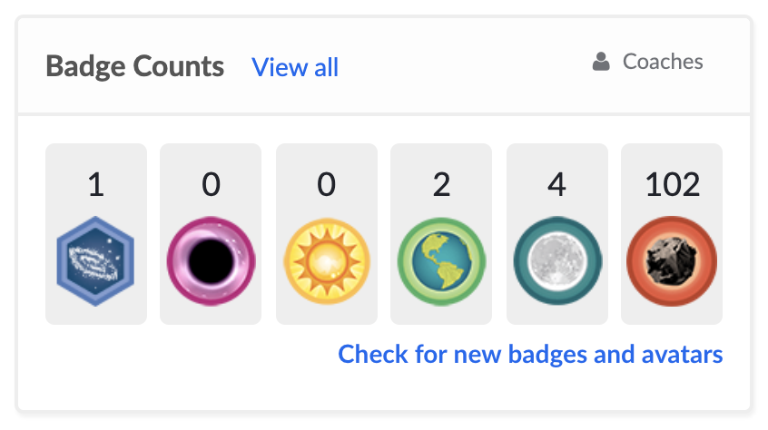

# Arrays

<a href="../">Back to Curriculum Index</a>

## Goals

- Use Ruby syntax to declare variables that store Arrays
- Explain use cases for Arrays
- Access elements by index
- Use array methods to add, remove, and shuffle elements

## Lists

Ruby provides us with a data type that can hold multiple pieces of data in a list. Imagine looking at a list of variables for each student in your class:

```ruby
student_1 = "Djavan"
student_2 = "Hillary"
student_3 = "Lindsey"
student_4 = "Latrina"
# etc...
```

This would soon be a LOT of code to initially type, to maintain over time and to create opportunities for typos. This pattern would defeat the point of programming which is to automate work!

If we have a list of similar items that we want to group together Ruby gives us a way to do that which only requires one variable.

## Arrays

An Array can hold as many pieces of data as we want it to. We refer to each piece of data as an **element**. The syntax Ruby expects for these lists is as follows:

```ruby
student_names = ["Djavan", "Hillary", "Lindsey", "Latrina"]
student_ids = [1456, 3287, 7610, 5711]
```

A few things to notice:
- Variable names should be plural
- Each element inside of the array is separated by a comma and one space
- All elements in the array are of the same data type (best practice but not required)

## Arrays IRL

It’s very likely that every application you’ve used - on a phone or laptop - utilized arrays in the code that built it.

We can’t see all the code that built every application, but there are some places where it’s very clear that an array would be the best tool to use. Here are some examples from sites we may be familiar with:

- [Instagram](https://www.instagram.com/alfie_the_alpaca_in_adelaide/) uses arrays to hold all the posts for a given user. Alfie the Alpaca has over 800 posts, so the array is over 800 elements long!
- [TikTok](https://www.tiktok.com/discover?lang=en) has an array of trending creators stored in their program. TikTok shows the information of the first four creators on the “Discover” page. When a user clicks the arrow to see more, TikTok shows the information of the next four trending creators, etc.
- [Khan Academy](https://www.khanacademy.org/) uses an Array to hold a users Badge Counts



```ruby
badge_count = [1, 0, 0, 2, 4, 102]
```

<div class="try-it-new">
  <h2>Share Out</h2>
  <p>Where might an array be used in one of the sites _you_ use on a regular basis?</p>
</div>

## Access Elements

We can rely on Arrays to keep our data in order. Each element, based on it's location in the Array, is assigned an index position. In programming, numbering starts at 0, so the first element is in position 0.

<!-- make little graphic like tiktok one for KWK -->
```ruby
student_names = ["Djavan", "Hillary", "Lindsey", "Latrina"]
```

The syntax to access an element is below. We instruct the program to that we want to look at the `student_names` array, then more specifically, the element at `X` position.

```ruby
student_names[1]
# --> "Hillary

student_names[3]
# --> "Latrina"
```

<div class="try-it-new">
  <h2>Try It: Declaring Arrays & Accessing Values</h2>
  <p>In repl, declare a variable that stores an array of at least 5 elements. You choose the content!</p>
  <p>Print out the entire array, then individually print out all 5 elements to the console.</p>
</div>

## Array Methods

push and pop

TRY IT

## Choosing a Random Element

shuffle
grab a certain index
print result

TRY IT: Popsicle Stick Jar

