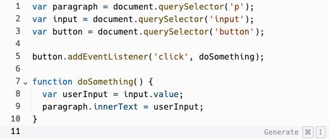

### Go Back

- [Welcome and Introductions](../)
- [Control Flow](../control-flow)

# User Input

Our programs haven’t been very exciting so far because we already know what will happen just by looking at the code. What if your program incorporated dynamic input from the user? For Front-End development, that's where HTML comes into play!

## What is HTML?

Of all of the major technologies used on the web, on either the Front-End or the Back-End, HTML, or Hyper Text Markup Language, is the oldest. [In the beginning](http://info.cern.ch/), the web was just a bunch of HTML documents that you wrote by hand. They had these _cool_ things called hyperlinks that would allow a user to click on a word on one page and be taken to another page.

HTML is still an essential part of modern web applications. It holds the content and creates the structure of a webpage.

<div class="try-it-new">
  <h2>Explore</h2>
  <p>To begin, let's look at <a href='https://replit.com/@turingschool/connect-html-js#script.js' target='_blank'>the code in this Replit</a>.</p>
  <p>After forking the replit, <b>be sure to open the dev tools</b>, then take a few minutes to look through the code in all the different files.</p>
  <p>Here are some things to consider as you explore:</p>
  <ul>
    <li>Does anything happen when you hit the green <code>Run</code> button?</li>
    <li>What about if we type something in the input and click on the button - do we see anything print out in the console?</li>
  </ul>
</div>

After exploring, let's take a look at some specific parts of the code below:

### HTML

```html
<p>Hello World!</p>
<input type="text" placeholder=" type something..." />
<button>Click Me!</button>
```

HTML is made up of a series of **elements**. Each of the lines above represents a different element. In order, we have one for putting text on the page, another for grabbing input from the user, and lastly a button that can be clicked on!

### JavaScript

```js
var paragraph = document.querySelector('p'); // a variable forthe paragraph element
var input = document.querySelector('input'); // a variable for the input element

var userInput = input.value; // a variable that stores the input from the user
console.log(paragraph.innerText); // printing the text of the paragraph to the console
console.log(userInput); // printing any text the user writes to the console
```

## Changing HTML from JavaScript

Displaying the information that's already on the page, in the console, is not all that helpful. It was just a stepping stone.

The next stepping stone is learning how to _change_ the text inside an HTML element from our JavaScript code.

<div class="try-it-new">
  <h2>Apply & Explore</h2>
  <p>Using the Replit you just forked:</p>
  <ol>
    <li>On <b>line 6</b> in your <code>script.js</code> file, type something like: <code>paragraph.innerText = "new text";</code></li>
    <li>Hit Run and look in the mini browser - it should display the text you typed in that last line of code!</li>
  </ol>
</div>

### Listening for Button Clicks

You may have noticed that the code you wrote changed the title of the page whenever we hit the <code>Run</code> button, and there were some other lines of code that only printed to the console when we clicked on the <code>Click Me!</code> button from the user interface.

What if we want to run some code that only happens when the button is clicked?

For now, we just need to know that the following code is responsible for running the code that happens when the button is cliked:

```js
var button = document.querySelector('button');

button.addEventListener('click', doSomething);

function doSomething() {
  // code you want to be run ONLY when button
  // is clicked, goes here.
}
```

<div class="try-it-new">
  <h2>Next Level</h2>
  <p>For this challenge, you'll use the same Replit you used for the previous one! In the previous challenge, you changed the title, but it happened on page load, so it wasn't very exciting.</p>
  <p><strong>Your Challenge:</strong> Combine the two new pieces of knowledge/skill you have to change the title only when the button is clicked.</p>

  <p><strong>Hint:</strong> You will need to use the <code>paragraph.innerText</code> and set it equal to the <code>input.value</code></p>
</div>

<div class="expander expander-lesson">
  <header>
    <h2 class="spicy-click">Solution:</h2>
    <div>
      <button class="expander-btn">
        
      </button>
    </div>
  </header>

  <div class="hide">
    <p>Here is our revised script.js file:</p>
    
    <p>Inside of the <code>doSomething()</code> function, we set the text of the paragraph equal to the value that the user typed into the input field!</p>
  </div>
</div>

<div class="module-card fe-project-card">
  <h3>Building a "Guess the Number" Game</h3>
  <p>Use <a href="https://replit.com/@turingschool/number-guesser-starter#script.js" target="blank">this replit</a> as a starting point. We are going to build a “Guess the Number” game for a user in the console. In the starter kit, you already have a <code>secretNumber</code> variable assigned to 6 and a some other JavaScript that connects the HTML to the game. Follow the steps below to keep going!</p>
  <p>Inside of the <code>checkGuess</code> function, write some code that will do the following:</p>
  <ol>
    <li>If the guess is less than the secret number, tell the user, "Not quite. Too low."</li>
    <li>If the guess is greater than the secret number, tell the user, "Oops. Too high."</li>
    <li>Otherwise, tell the user they guessed the number with the statement, "You did it!"</li>
    <li>Test your code a few times to make sure you can generate all 3 responses.</li>
  </ol>

  <p><strong>Hint:</strong> You will need to put together what we learned about Control Flow in the previous lesson, with changing the text on the screen.</p>
</div>

### Up Next

- [Ruby Number Guesser](../rb-number-guesser)
